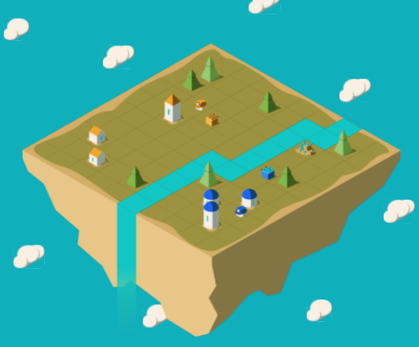
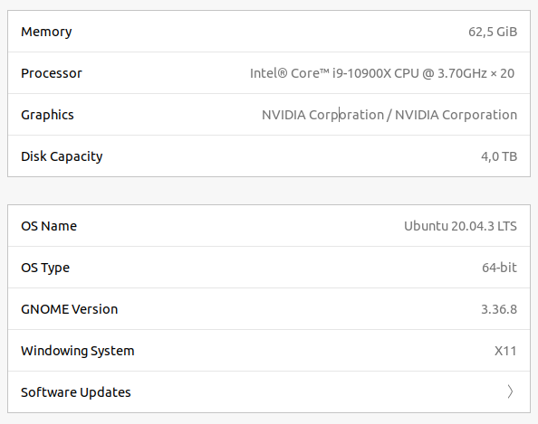

# luxai



Gather the most resources and survive the night!

https://www.kaggle.com/c/lux-ai-2021

## Solution presentation and description

[Google slides](https://docs.google.com/presentation/d/1eyoQmXgccuvxZjSgF0wyH_pzk0nY3BixBL4Ay0S2lmM/edit?usp=sharing)

[Kaggle post](https://www.kaggle.com/c/lux-ai-2021/discussion/293911)

## Methodology

I'm following [CRISP-DM 1.0](https://www.the-modeling-agency.com/crisp-dm.pdf) methodology for the reports.

I have skipped Evaluation and Deployment steps because they are not usually done on Kaggle.

1. [Business understanding](reports/01_Business_Understanding.md)
1. [Data understanding](reports/02_Data_Understanding.md)
1. [Data preparation](reports/03_Data_Preparation.md)
1. [Modeling](reports/04_Modeling.md)
1. [Solution summary](reports/05_Solution_Summary.md)
1. [Winning model documentation](reports/07_Winning_Model_Documentation.md)

* [Challenge workflow](reports/00_Challenge_Workflow.md)

## Code structure

     |_ luxai: library with code for the challenge
     |_ forum: all the scripts and notebooks taken from the forum
     |_ notebooks: jupyter notebooks made during the challenge. They start by number for easier sorting.
     |_ reports: documents made during the challenge according to CRISP-DM methodology
     |_ tests: folder with tests for the library
     |_ data: folder with light data from teh challenge
     |_ rules: the official rules of the challenge
     |_ agents: folder with agents for the challenge
     |_ scripts: scripts for training agents, playing the game...

## Hardware used during the challenge

My PC is described [here](https://pcpartpicker.com/b/jY8MnQ). It has two RTX3090 GPUs and the rest of the hardware can be seen below.



## How to train a model

### 1. Select matches to download

I did this with this [kaggle public notebook](https://www.kaggle.com/ironbar/select-agents-for-downloading-matches/notebook). It simply ranks the submitted agents by score and saves a csv file with the agents exceeding a threshold score. The exact csv file used on the final train can be found [here.](https://github.com/ironbar/luxai/blob/main/scripts/final_solution_files/agent_selection_20211201.csv)

### 2. Download the matches

To download the matches I use [Google colab](https://colab.research.google.com/drive/1XtHHPVzrSnLGoqZ_A0CKdz21gSFkN_CI?usp=sharing) that allows to do all the job online and later I simply have to download a zip file with all the matches.

### 3. Create train configuration files

We have to split the dataset between train and validation. For validation 10% of the matches from the best leaderboard agent were used.

Please replace TRAIN_FOLDER_PATH with the folder on your computer. Also edit the template.yml file
to use paths on your computer.

```bash
python scripts/train_imitation_learning/create_multiagent_imitation_learning_training.py scripts/final_solution_files/template.yml TRAIN_FOLDER_PATH 0 scripts/final_solution_files/agent_selection_20211201.csv 1700
```

### 4. Train

Run the following command and wait for around one day.

```bash
python scripts/train_imitation_learning/train_with_generators.py TRAIN_FOLDER_PATH/train_conf.yml
```

## How to create an agent

Creating an agent is very simple, just run this command giving the output folder for the agent and the path of the trained model.

```bash
python scripts/create_cunet_agent/create_cunet_agent.py AGENT_PATH TRAIN_FOLDER_PATH/best_val_loss_model.h5
```

## Additional dependences

[Keras Conditioned Unet](https://github.com/gabolsgabs/cunet) is used and should be downloaded. Then the
environment variable `KERAS_CUNET_PATH` should be set to the downloaded path.
