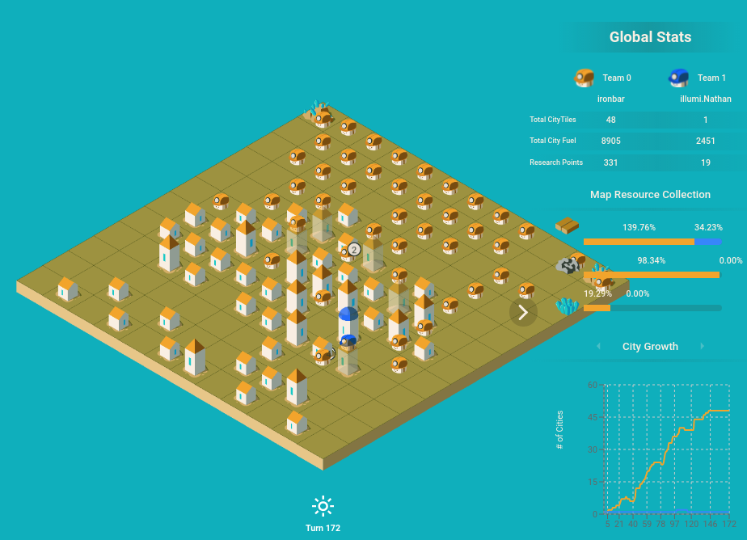
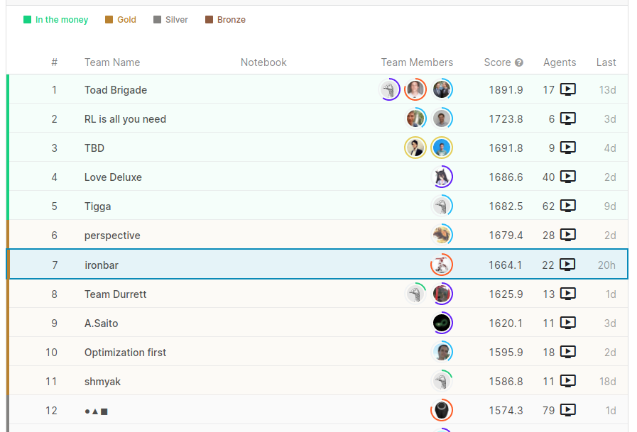
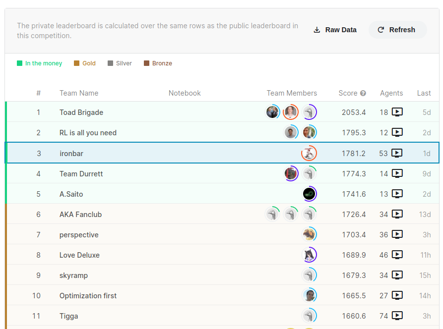
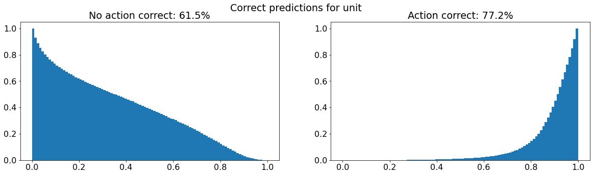
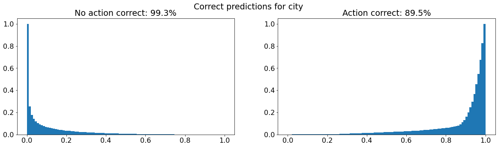
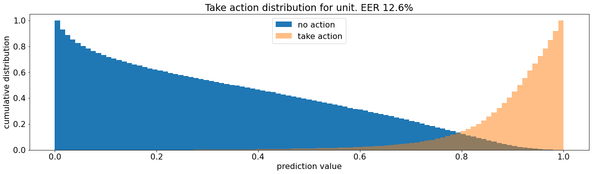
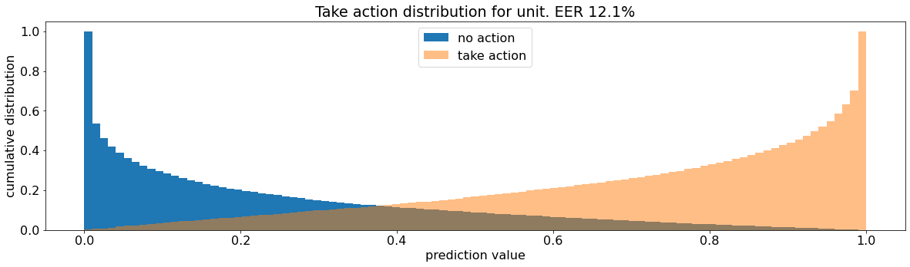
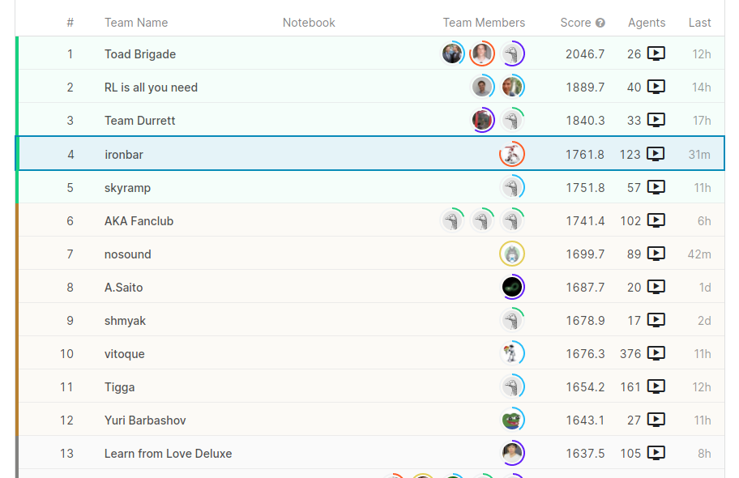

# Modeling

## Select modeling technique

<!---Document the actual modeling technique that is to be used. If multiple
techniques are applied, perform this task separately for each technique.
Many modeling techniques make specific assumptions about the data—for example,
that all attributes have uniform distributions, no missing values allowed,
class attribute must be symbolic, etc. Record any such assumptions made. --->

**TODO:** I will go back to this point once I have created some hand-made agents and
I have a better understanding of the game.

## Generate test design

<!---Describe the intended plan for training, testing, and evaluating the models.
A primary component of the plan is determining how to divide the available dataset
into training, test, and validation datasets.

Doing a plot of score vs train size could be helpful to decide the validation strategy

Depending on the size of the data we have to decide how we are going to use submissions.
The less the submissions the most confidence we can have on the score. However sometimes
the data distribution is very different, or the size of the data is small and we have
to make a lot of submissions. Sometimes is not easy to have a good correlation between
validation score and LB score
--->

I will start using a simple win ratio metric to verify that new agents are better
than the old ones. I should probably compute the win ratio against more than one
agent to verify that the new agent is robust.

## Iteration 1. Rule based agent

### 1.1 Goal

The goal is to identify the difficulties when making a rule based agent

### 1.2 Development

On a first step I'm going to start from the simple agent and make it better incrementally. All the work can be found on notebook `002_hand_made_agent`. I have refactorized the simple agent and later done the following updates:

1. Add research
2. Build new workers
3. Build new cities
4. Avoid collisions

With this I have created the first agent called `viral` that builds cities and workers as fast as possible.

#### 1.2.1 Ideas for improving the agent

It is surpring how complex behaviours arise from simple rules. We could improve by:

- Better movements. Learn to avoid obstacles, avoid going to a city if we want to build a new one
- Do not go over already used resources
- Careful at night, avoid stupid deaths
- Resources should be treated differently
- Using carts could have sense when moving to a new location, that way other units behind will move much faster
- It's interesting to see that a simple agent is able to consume all the resources in the map, or nearly all. but the match is pretty long.
- When using the random mode the unit can "forget" the task, goes to build a new home and suddenly decides to go to the closest city
- Sometimes there are bottlenecks where a lot of units are inside a house
- Moving to the closest resource may not be the best strategy if it is already crowded

We may have to switch the framework to a task based one. Maybe it's time to look at halite competition.

#### 1.2.2 Challenges found when creating an agent

- Agent dying in the night because it does not have resources to create light (seed 1)
- How to avoid collisions between units, how to coordinate the different goals of the units
- How to move to a new location avoiding obstacles

#### 1.2.3 Learnings

- I have realized that building new city tiles is much cheaper than surviving the night (100 resources vs 300 resources). That explains why agents in the forum do "only" worry about increasing the worker population and not about preserving houses.
- However I believe that maybe once coal or uranium are available it may have sense to preserve cities since using wood for cities is cheaper. Maybe carts could play a role there.
- Moving to center does not increase the cooldown
- Changing the board size while mantaining the seed creates a totally different board

### 1.3 Results

The agent `viral` scores around 974 on leaderboard, which is around position 100 on the leaderboard.
This agent beats the `simple_agent` around 94.5% of the times.

In this [link](https://www.kaggle.com/c/lux-ai-2021/submissions?dialog=episodes-submission-22702173) visualizations of the agent can be seen.
Below a picture of the viral agent with a big city before it collapses for lack of fuel on this [episode](https://www.kaggle.com/c/lux-ai-2021/submissions?dialog=episodes-episode-26566016).



### 1.4 Next steps

I would like to think about game strategy. Given the resources of a map, what the ideal agent will do.
For example I could compute what a forest could sustain. I can also think of city planning because if
I build in all the surroundings of a resource then I cannot grow anymore. Thus it may have sense to leave
holes so the city can grow, but then I have to use guards to avoid the enemy entering inside.
Probably it may have sense to send settlers to new forest at the start of the game since the surroundings
of a resource are the easiest place to build cities. At day a worker can travel to any place that is
located at a manhattan distance smaller than the half of the remaining day steps. Blocking the way of the enemy
could also be an interesting behaviour.

In the other hand I believe I have to switch to a framework that assigns tasks to the agents. This
will solve the problem of "forgetting" the current task and I have the feeling it will allow to scale
more complex behaviours easily than the current initial approach. Moreover I have seen that the same
philosophy was used on [Halite challenge](https://recursive.cc/blog/halite-iii-postmortem.html)

I don't know yet if there is room for machine learning. Maybe in the part of choosing an strategy, looking
at the board and identifying the key resources, the ideal layout of the city... But probably execution
is better done by code.

## Iteration 2. Task manager bot

### 2.1 Goal

The goal is to implement a task manager bot. At the start of the turn the bot will assign different
tasks to the units and later it will coordinate the actions based on their priority.

Hopefully this approach will scale better to complex behaviour than the one used on the first bot.

### 2.2 Development

I started thinking about this approach when dealing with collisions and when balancing between building
cities or gathering resources. Later I found that a very similar approach was described on [Halite challenge](https://recursive.cc/blog/halite-iii-postmortem.html)
Thus seeing that it has sense I have decided to implement it. I would love to get a bot that is
able to beat the viral agent more than 90% of the times.

#### 2.2.1 Dwight

After a complete redesign of the agent improving how the agent moves, avoid going out at night and a few
more small changes I have created agent `dwight` that is able to beat `viral` 65% of the times.
However in the forum performs very similar. Also I have found that there is a public agent that
scores around 1250, much better than my ~980.

Some ways of improving:

- Better assignment of targets for agents. They all currently go to the same cell. To be able to do
that I have to provide the current tasks of the other agents.
- A method to choose between building a new city or gathering fuel seems to be very important
- Better handling of night. Planning is needed.
- Cities should be treated as obstacles when going to build a new one

It seems that planning is crucial. We need to look at the future to be able to maximize the number
of cities at the end of the game. Simplifications of the game could help to planning, for example
we could represent the board with a graph being the nodes the clusters of resources and the edges
the distances between clusters.

A policy may help planning, but each map is different so it seems difficult to have a single policy.
Instead planning offers a general solution for all the maps.

I could devote a lot of time thinking about good strategies, and it will be funny, but I think planning
could solve that by brute force and I will learn more by taking the planning approach. Also I could
take the agent from the forum to fight with.

The game is an optimization problem: how to maximize the cities built at the end of the game given
the map resources and the opponent behaviour. My intuition is that planning is the best solution
for that problem, there might be very good solutions with rule-based agents, very good learned
policies... but I believe planning is the best solution.

### 2.3 Results

After a refactorization of the agent I have created agent `dwight` that is able to beat `viral` 65% of the times.
However in Kaggle performs very similar or worse.

Meanwhile an agent called `working_title` has been released in the forum that is able to beat
my agents around 95% of the times.

### 2.4 Next steps

I believe I should focus on planning. I have a strong enough agent from the forum to fight with. On
previous hungry geese challenge I missed the oportunity to apply planning and now I have to try it.

I could try to optimize an agent for a single map. Instead of thinking which strategies work best
I might simply overfit an agent to a map to find what is the best strategy for that map. Visualizing
that match will likely show something very close to the perfect agent. With that knowledge I could
later try to generalize to all the maps.

## Iteration 3. Interface for playing the game

### 3.1 Goal

The goal of this iteration is to create an interface to be able to play the game and to explore
the game to find good strategies.

### 3.2 Development

The idea is to create a simple yet usable game interface. I will have to create a visual representation
of the game with all the information needed to take the decisions and an interface.

One option is to create the interface using opencv. I have experience with it an it may work. Another
could be to use jupyter widgets. The first is based on keyboard while the second one relies more on
mouse.

One interesting thing is that the game representation I'm going to build could be later used for
training a model. Thus I have to diferentiate between game representation and game rendering.

#### 3.2.1 OpenCV

While doing the first renderings on a notebook I have noticed that pyplot is slow on the notebook.
It takes 400ms to show an image while only 100ms to create it. Thus it seems that I should better
use opencv just for speed reasons. 
The idea is to first render the game and then add an overlay of movements and visualization of the
current unit.

I'm going to first read some tutorials because I remember there were problems with some opencv versions
for conda that were not able to show images, and also there were different types of windows.

On 21/09/2021 I have a working version of the game interface. Now It's time to start playing and write
how I play and what would be the optimal way of playing. I can use the checkpoints to play alternative
strategies.

#### 3.2.2 Learnings

- A cart is able to move during day as fast as a worker, but leaves a road level of 1.5 behind so
all units following it could move without stopping.
- It is possible to build road on resources like wood, uranium and coal
- A cart cannot gather resources, it can only carry them
- If a house is built on a road, then the cell loses its previous road level when demolished
- Thus using carts may have sense when we want to speedup movement (maybe to go to another resource, or
to move faster in the forest) and also to carry resources from a resource to the city.
- To mine coal or uranium I believe the best strategy is to have workers on mining positions without moving and transferring resources to a cart. This ensures that the enemy cannot take the resource and at the same time I can move the cargo to the nearest city.
- In the other hand I believe forest should be mined with workers because collection speed is much faster.
- Carts can really speed processes because once they have visited a place the workers can move twice as fast
- Cities can be walls that protect the forrest

### 3.3 Results

I have implemented a user interface for playing the game and played on two maps. Playing is slow
because the current base agent I'm using creates wrong actions and I have to delete them and create from
zero. Having a more human agent could speedup playing.

At this point I have a much better understanding of the game and I believe I know a better strategy than
the one that is being used by top agents on the leaderboard. I have to think of how I can create an agent
that can play with that strategy.

### 3.4 Next steps

I can think of two different paths from here, I have already chosen Imitation learning but let's
document the two for reference.

#### 3.4.1 Hard coded agent

I have already written rules of how the agent should play on [Ideal agent](06_Ideal_agent.md). It should
be possible to translate those ideas to code. I believe a test-drive approach could work very well
for this case. I will prepare pairs of game state and actions and verify that my agent works as expected.
The number of tests will grow as the implementation gets more complex. I can use the game interface
to create those pairs.

However I don't think I will learn too much from this approach. Moreover people has already been taking this
approach for a long time so it will be difficult to catch up. And it is not easy to write a hard coded
agent as I have already seen on previous iterations.

#### 3.4.2 Imitation learning

Given enough resources I'm sure RL will be able to find a better strategy. But I don't believe I have
those resources. After studying the game complexity and considering the slow simulation of the game 
I believe RL would be very difficult for this game.

In the other hand imitation learning might work. The biggest drawback of imitation learning is that 
the agent may act strangely when it reaches a state of the game that was not encountered before. 
My idea of overcoming that problem is to pretrain the agent on matches from the forum, 
and then fine-tune on human matches. That could be a good combination.

The beauty of this approach is that I don't have to hard-code the agent and I will learn more about
imitation learning. That is why I have chosen to follow this approach.

## Iteration 4. Imitation learning from leaderboard agents

### 4.1 Goal

The goal is to explore how good an agent can become just by imitation learning and how many matches
do we need to imitate an agent.

In the best scenario we will end this iteration having an agent that performs close to the best
people on the leaderboard.

### 4.2 Development

#### 4.2.1 Tasks

- [x] Download matches from the leaderboard
- [x] Create features from game state
- [x] Implement a conditioned Unet architecture
- [x] Training script
- [x] Agent that uses a model for playing, it will need some post-processing of the predictions
- [x] Optimize the model architecture (optimize validation loss, but also measure agent score to see if they are correlated)
- [ ] Optimize input features
- [ ] Optimize training strategy (single train, pretrain and fine-tuning)

#### 4.2.2 Download matches from the leaderboard

As a start point I have a [notebook from the forum](https://www.kaggle.com/robga/simulations-episode-scraper-match-downloader)
and also for hungry geese I developed my own [notebook on colab](https://colab.research.google.com/drive/1SBm3BG0ZvlDKuiu02zuLrZ7oU6Dsp-se).

I remember that it was only possible to download 10k matches each session, that is why I started
using colab to avoid that limitation.

I only want to download matches from the best agents. To do so I should rank the agents based on their
latest score.

I have created a [kaggle notebook](https://www.kaggle.com/ironbar/select-agents-for-downloading-matches) to
select matches for downloading them. Now I'm going to download the matches using [colab](https://colab.research.google.com/drive/1XtHHPVzrSnLGoqZ_A0CKdz21gSFkN_CI?usp=sharing).

#### 4.2.3 Create features from game state

Board cell features:

- [x] Resources
- [x] Road level

Board global features:

- [x] Day/night cycle
- [x] Turn
- [x] Is Last day?

Player cell features:

- [x] Units
- [x] Cities
- [x] Cooldown
- [ ] City size (I don't have this feature available, but I don't think is very important)
- [x] Cargo
- [ ] is active (I'm not adding this one because I have set negative values for cooldown for an active city)
- [x] Fuel that can be gathered a turn (take into account research points)
- [x] Resources that can be gathered a turn (take into account research points)
- [x] Number of turns a city can survive at night

Player global features:

- [x] Research points (normalized to coal and uranium era)
- [x] Number of cities
- [x] Number of units

This [Imitation learning notebook](https://www.kaggle.com/shoheiazuma/lux-ai-with-imitation-learning)
has a very interesting way to compute the input features because it does not use the object provided
by luxai but directly parses the observation.

I need to compute the features, the actions and the masks for the predictions.

#### 4.2.4 Implement a conditioned Unet architecture

I want the model to generate actions for all the units and buildings at the same time. I also want to
use global information for taking the actions. Thus Unet seems like a very good fit for this problem.
However I also need to provide information such as day/night cycle, research points... So I have searched
for a conditioned Unet and I have found this paper [Conditioned-U-Net: Introducing a Control Mechanism in the U-Net for Multiple Source Separations](https://arxiv.org/abs/1907.01277)

I have read the paper and it seems the right way to tackle the problem. The ouput of the model will 
have binary cross-entropy loss because sometimes there are multiple actions for the same cell (imagine a unit inside a house)

It already has a [github implementation](https://github.com/gabolsgabs/cunet) that uses keras, so I
could try to use that code directly and see if it works.

Using that implementation as a start point I have prepared my own model that looks good. I also
need to implement a loss function that allows to use masks over the binary cross-entropy loss. Also
I have found that this implementation does not allow to use variable input size, so I will have to
add borders to boards smaller than 32x32.

##### 4.2.4.1 Tensorflow installation

I have found that in the kaggle notebooks tensorflow `2.4.0` is being used. However I had already installed
version `2.6.0` on my computer. To avoid losing time I will continue using `2.6.0` unless I find problems
when making the submissions. Thus I have an incentive to make a submission as soon as possible.

```bash
pip install tensorflow==2.6.0
pip install effortless_config
conda install -c conda-forge cudatoolkit==11.2.2 cudnn=8.1 -y
conda install -c conda-forge cudatoolkit-dev==11.2.2
pip install pydot graphviz
```

It is not founding `ptxas` even if I have installed `cudatoolkit-dev`.

#### 4.2.5 Training script

I have implemented a very simple training script. It loads 400 matches to memory because I cannot fit
more. On following iterations I will start using generators to overcome RAM limitations.

#### 4.2.6 Agent that uses a model for playing, it will need some post-processing of the predictions

I have implemented functions that allow to recover actions from predictions and verified that they
work when given the ground truth. Now I have to prepare an script that given a model path and
and output folder path it will create everything necessary to make a submission. I have to do this
as good as possible so I can reuse it later with new models.

I can take as a reference the work I did for hungry geese challenge.

```bash
cd "/mnt/hdd0/MEGA/AI/22 Kaggle/luxai/scripts/create_cunet_agent"
lux-ai-2021 --rankSystem="wins" --tournament  --maxConcurrentMatches 20 "clown/main.py" "working_title/main.py"
lux-ai-2021 "clown/main.py" "working_title/main.py"

```

```
Total Matches: 123 | Matches Queued: 39
Name                           | ID             | W     | T     | L     |   Points | Matches 
clown/main.py                  | RjsyUDGFuo9f   | 112   | 0     | 11    | 336      | 123     
working_title/main.py          | Amxi6tZ65x2Z   | 11    | 0     | 112   | 33       | 123     

#after fixing collisions
Total Matches: 521 | Matches Queued: 39
Name                           | ID             | W     | T     | L     |   Points | Matches 
working_title/main.py          | zjyVDttY1iGm   | 520   | 0     | 1     | 1560     | 521     
clown2/main.py                 | 7BhIkpq4HuJj   | 1     | 0     | 520   | 3        | 521     

```

I'm having trouble when uploading the model, it seems that the problem is that my luxai environment
has 3.9 python and kaggle uses 3.7. I was expecting this kind of problems and that's why I have
prepared this submission so soon. Thus I need to create a new conda environment and train the model again.

```bash
conda create -n luxai_37 pytest rope pylint tqdm numpy pandas scikit-learn ipython ipykernel coverage matplotlib python=3.7
source activate luxai
python -m ipykernel install --user --name $CONDA_DEFAULT_ENV --display-name "Python ($CONDA_DEFAULT_ENV)"
conda env export > environment.yml

conda create -n luxai_37 pytest rope pylint tqdm numpy pandas scikit-learn ipython ipykernel coverage matplotlib python=3.7
conda activate luxai_37
pip install tensorflow==2.6.0
pip install effortless_config
pip install pydot graphviz
conda install -c conda-forge cudatoolkit==11.2.2 cudnn=8.1 -y
pip install pyyaml
pip install kaggle-environments
pip install psutil
pip install nvidia-ml-py3
conda install -c conda-forge cudatoolkit-dev==11.2.2 -y
```

#### 4.2.7 Optimize the model architecture

I have run several experiments with the following conclusions:

- Data labels are very unbalanced so I have to give a weight of 32 to positive labels. Focal loss seems to help slighlty
- It seems that learning rate is not very relevant since I have tried with 2,4,8e-3 and results are almost the same.
- In the other hand increasing the batch size allows to reach training loss faster but maybe at the cost of poor generalization (not clear since val metrics are noisy)
- Unet filters: This has the greatest influence on train loss, the greater the number of filters the lower the loss.This suggest that the direction for improving is increasing the number of filters and increasing the training data
- Depth: 4 seems to be the optimum, 3 or 5 do not improve
- Condition: using a complex Film layer with a single hidden layer seems to be optimum

### 4.3 Results

I have been able to train agent `clown2` that achieves a LB score of 1358 and position 94/870. It is
far from the best agents (~1900) but it is a good start point for imitation learning.

### 4.4 Next steps

On the following iterations I want to scale up data. I will start by using data augmentation and I will
continue by using all the available data instead of using just the data that fits into memory.

## Iteration 5. Imitation learning with data augmentation

### 5.1 Goal

This is intended to be a short iteration where I implement data augmentation for training and measure
the improvement on the agent.

### 5.2 Development

Since the board is squared I can apply 90º rotations and also flips to multiply by 8 the amount of
training data.

I have to be careful with the actions of moving and transfer because the index of the layers should
be changed when applying the data augmentation. I will write tests to verify that data augmentation
is reversible.

I will also need to modify the training script to use a generator instead of an array of data.

#### 5.2.1 Pagliacci models

I have created a set of `pagliacci` models that have 32, 64 and 128 filters on the first layer of
the unet model. I have run two local tournaments:

```
Total Matches: 976 | Matches Queued: 39
Name                           | ID             | W     | T     | L     |   Points | Matches 
pagliacci_128/main.py          | RyKUtFiirJMv   | 305   | 7     | 107   | 922      | 419     
pagliacci_32/main.py           | bfgCCSIj0cc0   | 289   | 9     | 145   | 876      | 443     
pagliacci_64/main.py           | DbPktMtaVtIp   | 264   | 14    | 118   | 806      | 396     
clown2/main.py                 | oW1ycTIWUwaq   | 84    | 8     | 256   | 260      | 348     
working_title/main.py          | nygpdaZexM3E   | 15    | 0     | 331   | 45       | 346     


Total Matches: 898 | Matches Queued: 42
Name                           | ID             | Score=(μ - 3σ)  | Mu: μ, Sigma: σ    | Matches 
pagliacci_128/main.py          | uIEncBqBWeCr   | 26.0596907      | μ=28.554, σ=0.831  | 388     
pagliacci_64/main.py           | lwjqjgfaiHJ6   | 25.8941708      | μ=28.425, σ=0.844  | 397     
pagliacci_32/main.py           | Ev0DdTqxvQnq   | 23.9877369      | μ=26.396, σ=0.803  | 354     
clown2/main.py                 | TVRBKu8BvvLa   | 19.9573681      | μ=22.478, σ=0.840  | 347     
working_title/main.py          | 8FpBlwkv4lLC   | 13.2467371      | μ=16.224, σ=0.992  | 310     
```

I have realized that when using wins as the metric the number of matches is not asigned correctly. For
example notice that pagliacci_128 has played 20 matches less than plagiacci_32.

In the other hand using trueskill does not give interpretable results.

#### 5.2.2 Pretrain proof of concept

I would like to run a test to see if pretraining could improve generalization of the models. My idea
is to enable to load weights from a pretrained model and see if that improves the validation loss.
I will modify the csv file that is used for match selection to be able to do the experiment correctly.

We have pretrained with 800 matches and fine-tuned on 400 different matches.

| unet filters | pretrained best validation loss | from zero best validation loss |
|--------------|---------------------------------|--------------------------------|
| 32           | 0.2702                          | 0.2745                         |
| 64           | 0.2663                          | 0.269                          |
| 128          | 0.2599                          | 0.2621                         |

The validation loss with the pretrained model is consistently better but difference is not big.

#### 5.2.3 Training on a different number of matches

I have trained on 200, 400, 600, 800 and 1000 matches.

On this experiment I wanted to see the effect of using more matches for training. It is not obvious if that is good thing, because we are mixing
data from different agents, that play different. Probably is a good thing for pretraining but not sure about fine-tuning.

The validation set was different on each experiment, so that makes direct comparison impossible.

However we can see that the train losses relations are not trivial. They are not well organized and sorted from
less number of matches to biggest number of matches. This suggests that we have to do a deeper study in the
future.

Also I have to increase the limit of 50 epochs.

### 5.3 Results

I have created a set of `pagliacci` models that are currently scoring around 1450-1500 on leaderboard.
I'm currently on position 22/882 at day 28/10/2021.

### 5.4 Next steps

The next step is to implement a training script that is able to use all the data for training and
does not have RAM limitations. I will have to also experiment with the amount of data used for training
or fine-tuning the models.

## Iteration 6. Training on all the data

### 6.1 Goal

The goal of this iteration is to see if training with all the data yields improvements.

### 6.2 Development

#### 6.2.1 Training script

The idea is to load the matches in groups, for example of 50 and create batches from those matches
until there is no data left. Then load new matches and start again.

#### 6.2.2 Training on all the data

```bash
Total Matches: 177 | Matches Queued: 39
Name                           | ID             | W     | T     | L     |   Points | Matches 
pagliacci_32/main.py           | O1eks2TRoiMU   | 147   | 1     | 29    | 442      | 177     
napoleon_32/main.py            | 1jep9HhiTAJ2   | 29    | 1     | 147   | 88       | 177     
win/loss rate: 16/83%

Total Matches: 432 | Matches Queued: 40
Name                           | ID             | W     | T     | L     |   Points | Matches 
pagliacci_64/main.py           | ABc7rP1YXf9k   | 322   | 2     | 108   | 968      | 432     
napoleon_64/main.py            | sFcXldiaulXf   | 108   | 2     | 322   | 326      | 432     
win/loss rate: 25/74%

Total Matches: 136 | Matches Queued: 40
Name                           | ID             | W     | T     | L     |   Points | Matches 
pagliacci_128/main.py          | rKFXXW0q3g7q   | 62    | 29    | 45    | 215      | 136     
napoleon_128/main.py           | k71CkioerK2j   | 45    | 29    | 62    | 164      | 136     
win/loss rate: 33/45%

```

It seems that training in all the data creates weaker models. It also seems that the bigger the
model the difference it is able to learn better from all the data.

We need to see if this also holds in the public leaderboard. I have created a set of agents called `napoleon`
to test this.

### 6.3 Results

I have submitted a set of agents called `napoleon` and at the time of writing (29/10/2021) they score
1515, 1450 and 1344 for 128, 64, 32 filters respectively. Thus we can see the same pattern as the local
scores. Thus it seems that training in all the data yields worse results unless we use a very big model.

My hypothesis is that this happens because there are agents of very different skill, there is a big
difference between an agent scoring 1500 and another scoring 1800. Also the agents may have contradictory
policies that are harder to learn than simply learning from a single or a few agents.

### 6.4 Next steps

On the next iteration we are going to do the opposite. Instead of using data from all the agents we are going
to focus on training on a single or a few agents. Hopefully pretraining on all the data will be useful
on that little data trainings.

## Iteration 7. Focus on data from a single or a few agents

### 7.1 Goal

Previous iteration has shown that training on all the data yields worse results if the model is small.
So now we are going to do the opposite, to train just on the best agent or on the best n agents.

### 7.2 Development

#### 7.2.1 Data exploration

Let's see how many matches do the best agents have.

| SubmissionId | n matches | FinalScore  |
|--------------|-----------|-------------|
| 23032370     | 176.0     | 1818.288755 |
| 22777661     | 394.0     | 1711.493722 |
| 23034455     | 244.0     | 1710.606181 |
| 22934122     | 241.0     | 1651.606058 |
| 22902113     | 345.0     | 1650.975344 |
| 23159502     | 65.0      | 1650.841907 |
| 23038485     | 137.0     | 1643.818123 |
| 23010508     | 195.0     | 1643.516025 |
| 23008895     | 191.0     | 1636.605564 |
| 22931784     | 233.0     | 1636.232316 |

This shows that `pagliacci` agents that were trained with 400 matches were a mixture of the best and the second best agent.

#### 7.2.2 Train on single agents

Let's see if training on matches from a single agent yields better results than previous models. I will
have to try both with and without pretraining.

| name                              | win rate | matches |
|-----------------------------------|----------|---------|
| focus_rank0_32_filters_pretrained | 63.8%    | 252     |
| pagliacci_32                      | 44%      | 270     |
| focus_rank0_32_filters            | 41.1%    | 260     |

Clearly the use of pretrained weights is beneficial. So I will always be using pretrained from now on. Let's now run a tournament between rank0, rank1 and rank2 agents.

```bash
Total Matches: 154 | Matches Queued: 20
Name                           | ID             | W     | T     | L     |   Points | Matches 
pagliacci_32/main.py           | LEYo49y7BNud   | 52    | 0     | 31    | 156      | 83      
focus_rank0_32_filters_pretrained/main.py | uK26aXRH6AEF   | 51    | 1     | 37    | 154      | 89      
focus_rank1_32_filters_pretrained/main.py | kSfwkJ5hVqGE   | 36    | 0     | 40    | 108      | 76      
focus_rank2_32_filters_pretrained/main.py | 07wuE9koYaIs   | 14    | 1     | 45    | 43       | 60   
```

Since rank2 is clearly weaker I'm removing it from the tournament and starting again.

| name                              | win rate | matches |
|-----------------------------------|----------|---------|
| focus_rank0_32_filters_pretrained | 79.3%    | 63      |
| pagliacci_32                      | 40.2%    | 67      |
| focus_rank1_32_filters_pretrained | 32%      | 70      |

Clearly training just on the best agent is better than training just on other agents.

| name                               | win rate | matches |
|------------------------------------|----------|---------|
| focus_rank0_128_filters_pretrained | 70%      | 111     |
| focus_rank0_64_filters_pretrained  | 59.2%    | 108     |
| focus_rank0_32_filters_pretrained  | 33%      | 100     |
| pagliacci_32                       | 28%      | 89      |

It seems that using more filters is beneficial, I have made submissions for all three models.

#### 7.2.3 Train on a few agents

Let's start from the best agent and train on the best n agents and compare to just training on the
best single agent.

| name                               | win rate | matches |
|------------------------------------|----------|---------|
| focus_rank0_128_filters_pretrained | 61.5%    | 138     |
| pagliacci_32                       | 50%      | 150     |
| focus_best2_32_filters_pretrained  | 47.1%    | 138     |
| focus_best3_32_filters_pretrained  | 47.7%    | 1134    |
| focus_best4_32_filters_pretrained  | 46.4%    | 114     |
| focus_best5_32_filters_pretrained  | 43.1%    | 95      |

The table clearly shows that the best option is still to use the best agent. Using other agents
is not beneficial.

#### 7.2.4 Download more data from the cluster

I have seent that I have 176 matches from the best agent from the leaderboard but there are 329 matches
available as of today. Thus it seems likely that if I download that data I could get an improvement, since
it is almost twice the data.

I have also modified the weight loss when training because validation city action rises earlier than
unit action loss, so by reducing the city action loss weight I'm able to reduce this effect.

In this conditions I have created agents `superfocus` with the hope that we can reach even higher
in the leaderboard.

```bash
Total Matches: 303 | Matches Queued: 19
Name                           | ID             | W     | T     | L     |   Points | Matches 
superfocus_64/main.py          | ByUqHHxX2deM   | 263   | 0     | 40    | 789      | 303     
pagliacci_32/main.py           | rQoHanVqb4on   | 40    | 0     | 263   | 120      | 303     

Total Matches: 117 | Matches Queued: 19
Name                           | ID             | W     | T     | L     |   Points | Matches 
superfocus_128/main.py         | uyKFAGXqPNfL   | 67    | 19    | 31    | 220      | 117     
pagliacci_32/main.py           | SlhkSZZneShb   | 31    | 19    | 67    | 112      | 117     

Total Matches: 487 | Matches Queued: 19
Name                           | ID             | W     | T     | L     |   Points | Matches 
focus_rank0_64_filters_pretrained/main.py | s5iECdePSOGd   | 370   | 2     | 115   | 1112     | 487     
pagliacci_32/main.py           | xoxRGhv1IoQq   | 115   | 2     | 370   | 347      | 487     
```

| name                              | win rate | matches |
|-----------------------------------|----------|---------|
| superfocus_64                     | 86.7%    | 303     |
| focus_rank0_64_filters_pretrained | 75.9%    | 487     |
| supefocus_128                     | 57.2%    | 117     |

Seems that the `superfocus_64` is stronger, but the `supefocus_128` is weaker.

#### 7.2.5 Ensembling

As a last attempt of this iteration I'm going to train an ensemble combining `superfocus_64` models.
I will change the seed for choosing the train/val split and see how many models I can upload to kaggle.
On hungry_geese challenge the limit size for the submission was 100 MB, but on this challenge I don't
see if that limit exists.

```bash
Total Matches: 487 | Matches Queued: 19
Name                           | ID             | W     | T     | L     |   Points | Matches 
superfocus_64_ensemble/main.py | fPLm1P59wddY   | 480   | 0     | 7     | 1440     | 487     
pagliacci_32/main.py           | nevonCiIpeL5   | 7     | 0     | 480   | 21       | 487     
```

Teh win rate is 98.5% which is absolutely amazing. As of 30/10/2021 I have submitted 5 copies
of this agent with the hope that by the end of tomorrow they will have reached the 4 position
in the leaderboard. I need to reach to around 1690 leaderboard score.

### 7.3 Results

Training just on the single best leaderboard agent was found to be the best strategy. I believe there
are two reasons for this:

1. The best agent is much better than the other agents
2. There could be contradictory policies when using multiple agents

I have seen that the model behaves weirdly when playing against very bad agents, a sign that imitation
learning does not work well when the data comes from a different distribution.

On this iteration I have also implemented ensembles and weigth loss, because city action overfits
first.

At the time of writing there are less than 24 hours to finish the sprint 3. That means that my best
agent should play around 10 more matches. That may be enough to reach position 4.



At the time of writing the best model from previous iteration is `pagliacci_64` which has a score of 1527.
That means that we have improved more than 100 points on LB and it is likely that even more because
win rate of the `superfocus_64_ensemble` agent is very high and its score will go up.

### 7.4 Next steps

This are my ideas for improving:

- Data augmentation at test
- Check warnings from agent and add more post-processing to model output
- Download more data
- Lower learning rate when retraining
- LR policy when training on all the data
- Arquitecture search

## Iteration 8. Data augmentation at test

<!---
The work is done using short iterations. Each iteration needs to have a very
clear goal. This allows to gain greater knowledge of the problem on each iteration.
--->

### 8.1 Goal

The goal is to implement data augmentation at test time so we can improve the agent without having to improve the models.

Moreover if I'm able to make the submissions today I may decrease the score of other agents in the leaderboard and help to win the sprint 3.

### 8.2 Development

The idea is simple: to augment the data by doing flips and rotations to create a better prediction. The only complicated thing is that we have to invert the data augmentation on the predictions before we combine the predictions.

Also I don't really know if I will have enough time on Kaggle to combine ensembles and data augmentation but at least I have to try.

To verify locally that it works I will be using a single model agent. I will be using `pagliacci_32` as my baseline
since it has been used extensively for comparisons previously. I will be playing against `pagliacci_64`
because I initially started playing against the baseline agent and results were weird.

```bash
Total Matches: 385 | Matches Queued: 19
Name                           | ID             | W     | T     | L     |   Points | Matches 
pagliacci_64/main.py           | adtVllF8Drri   | 234   | 1     | 150   | 703      | 385     
pagliacci_32/main.py           | xVbRKUrrGSpQ   | 150   | 1     | 234   | 451      | 385     

Total Matches: 408 | Matches Queued: 20
Name                           | ID             | W     | T     | L     |   Points | Matches 
pagliacci_64/main.py           | iI0w2cRp4boI   | 221   | 4     | 183   | 667      | 408     
pagliacci_32_da_hf/main.py     | eF9Q4ZMzedmR   | 183   | 4     | 221   | 553      | 408  

Total Matches: 412 | Matches Queued: 20
Name                           | ID             | W     | T     | L     |   Points | Matches 
pagliacci_64/main.py           | fK8IHDOtYDR1   | 225   | 6     | 181   | 681      | 412     
pagliacci_32_da_2rot/main.py   | 0Dvv2aPqKghq   | 181   | 6     | 225   | 549      | 412     

Total Matches: 367 | Matches Queued: 19
Name                           | ID             | W     | T     | L     |   Points | Matches 
pagliacci_64/main.py           | ndv8sjZeHgrk   | 213   | 1     | 153   | 640      | 367     
pagliacci_32_da_4rot/main.py   | F9hs5K0Cl2hZ   | 153   | 1     | 213   | 460      | 367    

Total Matches: 380 | Matches Queued: 20
Name                           | ID             | W     | T     | L     |   Points | Matches 
pagliacci_64/main.py           | qiFb71pD2BFu   | 207   | 2     | 171   | 623      | 380     
pagliacci_32_da_full/main.py   | 8ya9Nj2RkoKj   | 171   | 2     | 207   | 515      | 380     
```

| name                 | win rate | matches |
|----------------------|----------|---------|
| pagliacci_32         | 38.9%    | 385     |
| pagliacci_32_da_hf   | 44.8%    | 408     |
| pagliacci_32_da_2rot | 43.9%    | 412     |
| pagliacci_32_da_4rot | 41.6%    | 367     |
| pagliacci_32_da_full | 45%      | 380     |

This experiment show that all data augmentation improve over the baseline, but we can see that we
get a very similar improvement when using just horizontal flip compared to using full data augmentation.

Finally I want to measure improvement with the ensemble.

```bash

Total Matches: 165 | Matches Queued: 19
Name                           | ID             | W     | T     | L     |   Points | Matches 
superfocus_128/main.py         | gyigFZZ0x3pq   | 89    | 1     | 75    | 268      | 165     
superfocus_64_ensemble/main.py | o8D2FokR9UK0   | 75    | 1     | 89    | 226      | 165     

Total Matches: 110 | Matches Queued: 20
Name                           | ID             | W     | T     | L     |   Points | Matches 
superfocus_64_ensemble_hf/main.py | o25MVDpkh17e   | 59    | 0     | 51    | 177      | 110     
superfocus_128/main.py         | wbStTSexuKLM   | 51    | 0     | 59    | 153      | 110     

Total Matches: 28 | Matches Queued: 20
Name                           | ID             | W     | T     | L     |   Points | Matches 
superfocus_64_ensemble_da/main.py | Ues8VNRi1LM1   | 15    | 0     | 13    | 45       | 28      
superfocus_128/main.py         | ebAUfnQ3DZgy   | 13    | 0     | 15    | 39       | 28   
```

| name                      | win rate | matches |
|---------------------------|----------|---------|
| superfocus_64_ensemble    | 47.8%    | 165     |
| superfocus_64_ensemble_hf | 53.6%    | 110     |

We can see a considerable improvement in win rate when using data augmentation.

Playing with all data augmentation is extremely slow, tomorrow I will try making a submission to see if it is
able to withstand the time limits. In around 30 minutes it only has been able to play 28 matches.

I have submitted the ensemble with full data augmentation and just by 8 seconds it was able to finish a 32x32 game, however it only lasted 200 seconds, so in a more balanced game is likely to timeout.
It has happen, timeout when playing against a stronger agent. This could be handled by reducing the number of augmentations

### 8.3 Results

On this iteration we have implemented data augmentation at test.

### 8.4 Next steps

## Iteration 9. More postprocessing of model predictions

### 9.1 Goal

The goal of the iteration is to add postprocessing to model predictions because some warnings have
been seen:

- a unit trying to build a city without the resources needed (does it spend the action, maybe is better to mask that options out and take the second higher action in that case)
- cities trying to make units when there is no more gaps available (probably is better to prioritize)

### 9.2 Development

#### 9.2.1 Study warnings shown

```bash
[WARN] (match_DVPnqsyFN2tR) - Agent 0 tried to build unit on tile (1, 1) but unit cap reached. Build more CityTiles!; turn 5; cmd: bw 1 1
```

In this case the city simply does nothing. In the next turn it researchs, so we have lost a turn. Thus
by postprocessing this we could gain time and prioritize where the new units are created.

```bash
[WARN] (match_DVPnqsyFN2tR) - Agent 0 tried to build CityTile with insufficient materials wood + coal + uranium: 96; turn 40; cmd: bcity u_5
```

This could be solved with a mask applied to units that have 100 resources.

```bash
[WARN] (match_DVPnqsyFN2tR) - Agent 0 tried to build CityTile on non-empty resource tile; turn 44; cmd: bcity u_8
```

This could also be solved with a mask, I have to check the order of action resolution because it may
be the case of a tree disapearing and a house being built at the same time. Resource collection is done after
unit actions, so we can safely mask that.

#### 9.2.2 Implementation and testing

- [x] Do not build more units that allowed
- [x] Do not build cities when resources are not available
- [ ] Do not build cities on non-empty resource tiles

I have to first verify that warnings do not happen anymore and also that the agent is equal or better than
the previous one. I will be using `superfocus_64` as my workhorse.

| name                              | win rate | matches |
|-----------------------------------|----------|---------|
| superfocus_64                     | 86.7%    | 303     |
| do not build cities if not posible| 84.8%    | 840     |
| do not build units if not possible| 85.5%    | 353     |

After implement the two first post-processing algorithms I don't see a significative improvement on
win rate. However I have also fixed a bug that was also affecting to the collision of the units
because identifiers for city tiles were incorrect.

Thus I don't think it has sense to implement the third one since it happens much less frequently.

### 9.3 Results

I have implemented post-processing on the actions that succesfully removed the game warnings. However
it did not have a significative change on local score. It is soon to see if it has an effect
on leaderboard.

### 9.4 Next steps

Hints for new features, make it very easy for the model:

- can unit build?
- is cell empty?
- number of new units that can be build
- obstacles

Maybe studying the predictions over validation set I could come with new feature ideas.

## Iteration 10. Download more data for pretraining

### 10.1 Goal

On this iteration I will download more data for pretraining and study if setting some threshold
on the score for choosing the train data has an effect on validation score when fine-tuning.

### 10.2 Development

#### 10.2.1 Tasks

- [x] See if I can add the name of the team to the dataframe with the matches
- [x] Download more submissions
- [x] Create a script to generate npz files from json in parallel
- [ ] Experiment with different thresholds on pretrain data

I have seen that since the first time I downloaded data the team `Toad Brigade` has submitted two more
agents of a similar level to the one I used to train on. I believe it is likely that training on those
three models will yield better results. They currently have scores of 1911, 1903 and 1896, the fourth 
one has 1720.

#### 10.2.2 Fine-tuning on three best `Toad Brigade` agents

I'm going to create a new version of `superfocus_64` models that are trained on the three best
`Toad Brigade` agents. If this set of models is better then I will do following experiments with
this setup on mind. This more than doubles the amount of data used on `superfocus_64` models.

```bash
Total Matches: 808 | Matches Queued: 20
Name                           | ID             | W     | T     | L     |   Points | Matches 
three_toad/main.py             | pkEDFufn49DY   | 499   | 8     | 301   | 1505     | 808     
superfocus_64/main.py          | iohzNqleLvik   | 301   | 8     | 499   | 911      | 808     
61.7% win rate

Total Matches: 121 | Matches Queued: 19
Name                           | ID             | W     | T     | L     |   Points | Matches 
three_toad_ensemble/main.py    | AfrENe5exehz   | 81    | 0     | 40    | 243      | 121     
superfocus_64_ensemble/main.py | iGUWy18s1a81   | 40    | 0     | 81    | 120      | 121     
66.9% win rate

Total Matches: 168 | Matches Queued: 20
Name                           | ID             | W     | T     | L     |   Points | Matches 
three_toad_ensemble_longer/main.py | 7PB981IZzXEG   | 101   | 0     | 67    | 303      | 168     
superfocus_64_ensemble/main.py | Zlj0Q7YWVAQy   | 67    | 0     | 101   | 201      | 168     
60.1% win rate
```

It seems that training on the best three models is giving a better result. I have submitted `three_toad_ensemble`
agent to kaggle to see if it is also better on the leaderboard.

#### 10.2.3 Find optimum pretraining strategy

Since it seems that fine-tuning on three best `Toad Brigade` agents is the best current strategy I'm
going to exclude those agents from pretraining for a fair comparison. However once the best pretraining
configuration it is found and a model for submission is going to be created I will recover those agents
for pretraining.

The idea is to use a threshold over leaderboard score to exclude some of the agents and see if
it is better to use all the data or for example agents with a score above 1600. The baseline will
be a model without pretraining.

For this experiments I will exclude fine-tuning data from pretraining, althought when going to
create an agent for submission I will be including them.

- All pretrained models beat the model without pretraining.
- 1650 threshold is clearly worse than the others
- The optimum threshold seems to be 1550 with current data.

I need to create a different train and val partition for pretraining.

#### 10.2.4 Train an ensemble

Now let's train an ensemble with these conditions:

- Pretrain 7 models on agents with a score higher than 1550 and different seeds for the data
- Fine-tune each model on three best `Toad Brigade` agents with different seeds for the data

This ensemble might be better than previous ensembles because it uses more and better data for
pretraining and because each fine-tuned model will have different pretrained weights so the ensemble
will be more diverse.

```python
import pandas as pd
import os

df = pd.read_csv('/home/gbarbadillo/luxai_ssd/agent_selection_20211102_teams.csv')
df = df[df.FinalScore >= 1550]
df.reset_index(drop=True, inplace=True)

def save_train_and_val_data(folder, seed):
    os.makedirs(folder, exist_ok=True)
    train = df.loc[[idx for idx in range(len(df)) if (idx + seed) % 20]]
    val = df.loc[[idx for idx in range(len(df)) if not (idx + seed) % 20]]
    train.to_csv(os.path.join(folder, 'train.csv'), index=False)
    val.to_csv(os.path.join(folder, 'val.csv'), index=False)

for idx in range(7):
    save_train_and_val_data(folder='/mnt/hdd0/Kaggle/luxai/models/24_diverse_ensemble/pretrain/seed%i' % idx, seed=idx)
```

```bash
for i in {1..6}; do cp -r seed0/ seed${i}; done
for i in {1..6}; do sed -i "s/seed0/seed${i}/g" seed${i}/train_conf.yml; done 
for i in {1..6}; do sed -i "s/test_split_offset: 0/test_split_offset: ${i}/g" seed${i}/train_conf.yml; done 
cat */*.yml | grep seed
cat */*.yml | grep split_offset
```

I have called this new ensemble `three_toad_deluxe`.

```bash
Total Matches: 215 | Matches Queued: 19
Name                           | ID             | W     | T     | L     |   Points | Matches 
three_toad_deluxe/main.py      | 5fAbR3bfguo5   | 152   | 2     | 61    | 458      | 215     
superfocus_64_ensemble/main.py | RAG7GhEBIpRg   | 61    | 2     | 152   | 185      | 215     
win rate: 70.6%
```

### 10.3 Results

On this iteration we have create the set of agents `three_toad` that are pretrained on a lot of data
and fine-tuned with just the three best Toad Brigade agents. Local scores show an improvement over previous models,
more time is needed to see if this reflects on the leaderboard. Visualization of the matches on kaggle
suggests that new models are much more stronger and have more intelligence than previous ones.

### 10.4 Next steps

## Iteration 11. Architecture search

### 11.1 Goal

On this iteration I want to do variations over the architecture to see if I can reduce the validation
loss (thus doing a better imitation). 

Initially I just want to do:

- Increase the depth to see if beneficial to have a more global view
- Increase the capacity of the conditional input
- Increase the overall capacity of the model

### 11.2 Development

The goal is to reduce the validation loss when training on three best Toad Brigade agents. In order
to do that I have to first pretrain on the agents with a leaderboard score higher than 1550.
Thus for each architecture variation I have to both pretrain and fine-tune.

Maybe I have to modify the interface to create the cunet model to enable setting the number of filters
on each layer. This will allow to increase depth without increasing the number of parameters too much.

Results when pretraining and smoothing 0.8 over the loss.

| name                                          | model size (MB) | best train epoch loss | best val epoch loss |
|-----------------------------------------------|-----------------|-----------------------|---------------------|
| 01_baseline_filters_64_128_256_512_final_32   | 14.4            | 0.2774                | 0.303               |
| 02_baseline_filters_128_256_512_1024_final_64 | 56.6            | 0.2625                | 0.2945              |
| 03_filters_64_128_256_512_final_64            | 14.5            | 0.2736                | 0.2977              |
| 04_filters_128_128_256_512_final_64           | 15.7            | 0.2692                | 0.3004              |
| 05_filters_128_256_256_512_final_64           | 21.1            | 0.2648                | 0.2967              |
| 06_filters_128_256_512_512_final_64           | 37.6            | 0.2635                | 0.2954              |
| 07_filters_128_128_256_512_final_128          | 16.3            | 0.2546                | 0.2959              |
| 08_filters_256_256_256_512_final_256          | 28.9            | 0.2559                | 0.2944              |
| 09_filters_256_256_256_256_final_256          | 24.1            | 0.2554                | 0.2962              |
| 10_filters_512_x4_final_512                   | 95.3            | 0.2501                | 0.2892              |
| 11_filters_384_x4_final_384                   | 53.8            | 0.2512                | 0.2906              |

Now the results when fine-tuning, which are the deciding ones.

| name                                          | model size (MB) | best val epoch loss |
|-----------------------------------------------|-----------------|---------------------|
| 01_baseline_filters_64_128_256_512_final_32   | 14.4            | 0.192               |
| 02_baseline_filters_128_256_512_1024_final_64 | 56.6            | 0.1841              |
| 03_filters_64_128_256_512_final_64            | 14.5            | 0.1899              |
| 04_filters_128_128_256_512_final_64           | 15.7            | 0.1862              |
| 05_filters_128_256_256_512_final_64           | 21.1            | 0.1832              |
| 06_filters_128_256_512_512_final_64           | 37.6            | 0.1828              |
| 07_filters_128_128_256_512_final_128          | 16.3            | 0.1814              |
| 08_filters_256_256_256_512_final_256          | 28.9            | 0.1765              |
| 09_filters_256_256_256_256_final_256          | 24.1            | 0.1766              |
| 10_filters_512_x4_final_512                   | 95.3            | 0.1735              |

Considering the number of parameters my choosing is `09_filters_256_256_256_256_final_256` for
generating the next ensemble.

```bash
Total Matches: 215 | Matches Queued: 19
Name                           | ID             | W     | T     | L     |   Points | Matches 
three_toad_deluxe/main.py      | 5fAbR3bfguo5   | 152   | 2     | 61    | 458      | 215     
superfocus_64_ensemble/main.py | RAG7GhEBIpRg   | 61    | 2     | 152   | 185      | 215     
win rate: 70.6%

Total Matches: 102 | Matches Queued: 20
Name                           | ID             | W     | T     | L     |   Points | Matches 
optimus_prime/main.py          | 37gRryyCVUPL   | 78    | 0     | 24    | 234      | 102     
superfocus_64_ensemble/main.py | OizifUz24VEj   | 24    | 0     | 78    | 72       | 102   
win rate: 76.4%

Total Matches: 79 | Matches Queued: 19
Name                           | ID             | W     | T     | L     |   Points | Matches 
optimus_prime/main.py          | u6oRbfj4e2FK   | 55    | 0     | 24    | 165      | 79      
three_toad_deluxe/main.py      | cI98Ah6LgDSQ   | 24    | 0     | 55    | 72       | 79  
win rate: 69.6 %
```

New `optimus_prime` is clearly better than previous ensembles.

### 11.3 Results

On this iteration I have improved the model architecture and also the training learning rate policy.
As a result I have create the set of `optimus_prime` agents that beat consistently my previous agents.
I have just submitted them to the leaderboard so I have to wait until they get to their real score.

### 11.4 Next steps

What if I train only on victories? That does not make sense in the context of imitation learning
because we want to copy the behaviour, so the result of the match is irrelevant.

Try on non-greedy policies. I have seen some oscilating behaviours of the units that could be caused
by choosing the action with the maximum probability.

Policy gradient.
I believe that if I play 200 matches and train on wins and also on loses with negative target I should
be able to improve the policy and achieve a higher win rate against that agent. There might be more
efficient ways to do it but that should work.

I'm going to first try with non-greedy policies and later move to policy gradients to try to improve
the agents.

## Iteration 12. Non greedy policy

### 12.1 Goal

The goal of this iteration is to experiment using non-greedy policies to see if there is an improvement.
The motivation comes from units oscilating between two positions: moving north, south, north, south...
This might be cause by simply choosing the action with maximum probability. Adding a little bit
randomness might improve the agent.

### 12.2 Development

I should first refactor action choosing to allow adding randomness. Current strategy is to choose the
action with the highest probability and if it exceeds a threshold then the action is taken.

I believe we should keep using a threshold to decide between taking or not taking an action. That seems
the right way to do it because we don't have another way to not taking an action with the current
implementation.

On a first step I have done a sweep over different thresholds for taking or not taking an action.
I have been using the agents `three_toad_deluxe_single` and `optimus_prime_single`, the later one
was the one changing the threshold. On a second step I have tried a random policy that randomly
chooses between the actions that exceed the threshold.

The table below suggests that a threshold of 0.6 may be better than the default 0.5. It also
seems that the random policy is worse than the greedy for playing.

| policy | threshold | wins | matches | win rate | uncertainty 95% |
|--------|-----------|------|---------|----------|-----------------|
| greedy | 0.2       | 86   | 209     | 41.1%    | 6.7%            |
| greedy | 0.3       | 200  | 356     | 56.2%    | 5.2%            |
| greedy | 0.4       | 215  | 376     | 57.2%    | 5.0%            |
| greedy | 0.5       | 201  | 348     | 57.8%    | 5.2%            |
| greedy | 0.6       | 397  | 608     | 65.3%    | 3.8%            |
| greedy | 0.7       | 250  | 379     | 66.0%    | 4.8%            |
| greedy | 0.8       | 111  | 210     | 52.9%    | 6.8%            |
| random | 0.5       | 11   | 55      | 20.0%    | 10.6%           |
| random | 0.6       | 415  | 645     | 64.3%    | 3.7%            |
| random | 0.7       | 367  | 650     | 56.5%    | 3.8%            |

When playing with the ensemble I do not see significative difference when using the threshold of 0.6.

```bash
Total Matches: 79 | Matches Queued: 19
Name                           | ID             | W     | T     | L     |   Points | Matches 
optimus_prime/main.py          | u6oRbfj4e2FK   | 55    | 0     | 24    | 165      | 79      
three_toad_deluxe/main.py      | cI98Ah6LgDSQ   | 24    | 0     | 55    | 72       | 79  
win rate: 69.6 % +- 10.1


Total Matches: 385 | Matches Queued: 19
Name                           | ID             | W     | T     | L     |   Points | Matches 
optimus_prime_th06/main.py     | utD4xGqPYpPC   | 272   | 1     | 112   | 817      | 385     
three_toad_deluxe/main.py      | 2UxnYrjOJ6oG   | 112   | 1     | 272   | 337      | 385     
win rate: 70.8 % +- 4.6
```

### 12.3 Results

I have tried using different thresholds over the actions and following a random policy instead
of a greedy one. On individual models setting a higher threshold such as 0.6 show improvements but
there was no evidence of improvement when using the ensemble.

### 12.4 Next steps

I believe there might be room for improvement using imitation learning:

- Add more features
- Study errors on val set
- Why the agent does not gather coal and uranium as good as wood

However I'm going to try with Policy gradients because it seems more promising and I will learn more.

## Iteration 13. Proof of concept with Policy gradients

### 13.1 Goal

The goal of the iteration is to see if by using policy gradients I can increase the win rate of an
agent playing against another agent.

I won't care about generalization against other agents: I'm going to take an agent and play against
a frozen version of itself until it beats consistently. If it works then I will do more iterations
with a more general goal.

### 13.2 Development

The idea is to use the luxai cli to play tournaments, save the matches to file and then use those matches
for training. I will train just like on imitation learning with the exception that on loses I will invert
the target actions so it learns to do the opposite.

However I have found that the luxai cli saves the json files on a different format to kaggle.
Thus I need another way of playing matches, or to translate from one format to the other. The first
option seems better since it will allow to control how many matches are played more easy than with
the command line interface.

#### 13.2.1 Play and save games in parallel

I'm going to have a look at how I managed on hungry geese challenge to play matches in parallel. I
will likely have to modify the agent template again since when using python interface I need to provide
the absolute path to the model.

It takes around 5.5 minutes to play 100 matches with `superfocus_64` agent against itself.

#### 13.2.2 Policy gradients

The idea is to play n matches, train on those matches, save the model and play again in a loop. I want
to have metrics of how the win rate is changing over time. I will be using a greedy policy for this
probe of concept.

When playing 100 matches per round uncertainty on the win rate will be around 10% on the worst case.
Thus to be able to probe that it works we have to reach a win rate of 70%, that is the goal of the
experiment. Hopefully we will start at 50% win rate and steadily grow up to 70% and even more.

#### 13.2.3 Batch normalization

I have tried using different ways of using the data for training and all of them were worsening the model,
even when using very low learning rates. Then I have run a training with learning rate zero and to my
surprise the worsening was almost the same. When analizing the weights of the model I have found that
the only change was the parameters of the batch normalization layers.

It seems that the data distribution of the matches used for policy gradients is different to the distribution
from the matches of the leaderboard and that was causing the agent to fall from a win rate of 50% to
around 30%.

Thus I have implemented the option to freeeze the batch normalization layers and thus only change the
weights of the other layers.

### 13.3 Results

After many experiments I have not being able to improve an agent using my implementation of policy gradients.
Maybe I need to be more patient with the experiments, but the end of the challenge is approaching and
I should focus on the most promising options.

## Iteration 14. Curriculum for imitation learning

### 14.1 Goal

The goal of this iteration is to implement an automated pipeline to do curriculum learning for imitation
learning. The best existing models have been trained by first pretraining on a lot of agents of the leaderboard
and finally fine-tuning on the best 3 agents. I have the feeling that this could be done better if I
add more stages to the training. This way I will be training on agents of increasing skill and that's why
I'm calling this iteration curriculum learning.

### 14.2 Development

The idea is to create a script that given a template, a seed, the dataframe with all the agents and
the thresholds that define the curriculum it will create the folders and files to do the trainings
and also a bash script that will do all the steps.

Thus I will have an automated way of training models that I could reuse when downloading more matches
from the leaderboard.

```bash
python create_curriculum_training.py /mnt/hdd0/Kaggle/luxai/models/35_curriculum_learning/template.yml /mnt/hdd0/Kaggle/luxai/models/35_curriculum_learning 1 /home/gbarbadillo/luxai_ssd/agent_selection_20211113.csv 1600 1650 1700 1800 1950 2000

Stage 0 matches: 12280  agents: 42
Stage 1 matches: 8138   agents: 39
Stage 2 matches: 2521   agents: 14
Stage 3 matches: 462    agents: 1
Stage 4 matches: 306    agents: 1
Stage 5 matches: 293    agents: 1
```

### 14.3 Results

I have created the agent `megatron` that is able to defeat 60% of the times the agent `optimus_prime`
and 73% of the times `three_toad_deluxe`.

### 14.4 Next steps



The end of the challenge is approaching and Toad Brigade still has a great advantage over the other players.
So it makes sense to devote all my efforts to keep improving imitation learning because I might be second
in the challenge if I'm able to better imitate them.

## Iteration 15. Add new input features

### 15.1 Goal

The goal of this iteration is to try with new input features to see if that enables better imitation
learning. I have not changed the input since the beginning of the challenge so there may be room
for improvement.

### 15.2 Development

My idea is to take a subset of the data, for example the three best Toad Brigade agents and train
an agent on that data. Input features will be modified along experiments and validation loss will
be the evaluation metric. Once we find the optimal configuration we will train an ensemble with it.

```python
import pandas as pd
df = pd.read_csv('/home/gbarbadillo/luxai_ssd/agent_selection_20211113.csv')
df[df.FinalScore > 1900].to_csv('/home/gbarbadillo/luxai_ssd/agent_selection_20211113_three_toad_brigade.csv', index=False)
```

```bash
cd scripts/train_imitation_learning
python create_curriculum_training.py /mnt/hdd0/Kaggle/luxai/models/36_feature_engineering/template.yml /mnt/hdd0/Kaggle/luxai/models/36_feature_engineering 0 /home/gbarbadillo/luxai_ssd/agent_selection_20211113_three_toad_brigade 1600
cd ../preprocess_data
python json_to_npz.py /home/gbarbadillo/luxai_ssd/agent_selection_20211113_three_toad_brigade.csv /home/gbarbadillo/luxai_ssd/matches_20211014/matches_json /home/gbarbadillo/luxai_ssd/matches_20211014/experimental/hour
```

#### 15.2.1 Current features

##### 15.2.1.1 Board features

| name                                 | explanation                                         |
|--------------------------------------|-----------------------------------------------------|
| wood                                 | amount / 800                                        |
| coal                                 | amount / 800                                        |
| uranium                              | amount / 800                                        |
| player_worker                        | n_units                                             |
| player_cart                          | n_units                                             |
| player_city                          | binary                                              |
| opponent_worker                      | -                                                   |
| opponent_cart                        | -                                                   |
| opponent_city                        | -                                                   |
| cooldown                             | ( cooldown  -  1 )/ 10                              |
| road_level                           | road_level/6                                        |
| player_city_fuel                     | n_nights_survive                                    |
| opponent_city_fuel                   | -                                                   |
| player_unit_cargo                    | cargo/max_cargo                                     |
| opponent_unit_cargo                  | -                                                   |
| player_unit_fuel                     | fuel/max_fuel                                       |
| opponent_unit_fuel                   | -                                                   |
| player_city_can_survive_next_night   | -                                                   |
| opponent_city_can_survive_next_night | -                                                   |
| player_city_can_survive_until_end    | -                                                   |
| opponent_city_can_survive_until_end  | -                                                   |
| resources_available                  | how many resources can be gathered at that position |
| fuel_available                       | how many fuel can be gathered at that position      |
| playable_area                        | 1                                                   |

These features look ok.

##### 15.2.1.2 1d features

| name                       | explanation           |
|----------------------------|-----------------------|
| step                       | step/360              |
| is_night                   | step % 40 > 30        |
| is_last_day                | step > 40*8           |
| player_research_points     | research_points / 200 |
| opponent_research_points   | -                     |
| is_player_in_coal_era      | research_points > 50  |
| is_player_in_uranium_era   | research_points > 200 |
| is_opponent_in_coal_era    | -                     |
| is_opponent_in_uranium_era | -                     |
| player_n_cities            | cities/10             |
| player_n_units             | units/10              |
| opponent_n_cities          | -                     |
| opponent_n_units           | -                     |

I'm not sure if knowing how many units and cities does each player has is relevant. Maybe is better
to know if we are winning or losing by taking the difference between both. I don't think knowing
that I have 40 or 50 units will change how the bot acts.

#### 15.2.2 Proposed new features

##### 15.2.2.1 Board features

| name           | explanation                                          |
|----------------|------------------------------------------------------|
| is_unit_full   | cargo == max_cargo                                   |
| is_cell_empty  | no resources or cities on cell                       |
| can_build_city | binary                                               |
| obstacles      | enemy cities + units with cooldown >=1 not in cities |

- can I move to a position without risk of collision?
- split cooldown

##### 15.2.2.2 1d features

| name         | explanation                          |
|--------------|--------------------------------------|
| hour         | step % 40 / 40                       |
| city_diff    | (player_cities - opponent_cities)/10 |
| n_unit_slots | n_cities - n_units                   |

#### 15.2.3 Experiment results

| name                               | val loss | val loss round 0.6 |
|------------------------------------|----------|--------------------|
| 01_baseline_with_original_features | 0.1722   | 0.1751             |
| 02_add_hour                        | 0.1698   | 0.1703             |
| 03_add_can_build_city              | 0.1634   | 0.1693             |
| 04_obstacles                       | 0.1656   | 0.1704             |
| 05_city_diff                       | 0.1649   | 0.1661             |
| 06_unit_free_slots                 | 0.1665   | 0.171              |

It does not seem that obstacles is beneficial. There might be a better learning rate policy that could
make me repeat the experiments, be less patient but reduce the learning rate less.

| name                               | val loss   | val loss round 0.6 |
|------------------------------------|------------|--------------------|
| 01_baseline_with_original_features | 0.1674     | 0.1728             |
| 02_add_hour                        | 0.1656     | 0.169              |
| 03_add_can_build_city              | 0.1653     | 0.1668             |
| 04_obstacles                       | 0.1657     | 0.1679             |
| 05_city_diff                       | 0.1625     | 0.1665             |
| 06_unit_free_slots                 | 0.1619     | 0.1659             |
| 07_remove_cities_and_units         | **0.1615** | **0.1656**         |
| 08_remove_obstacles                | 0.1639     | 0.1665             |
| 09_split_cooldown                  | 0.164      | 0.1661             |

On this comparison we have been able to improve validation loss from 0.1674 to 0.1615 just
by changing the features.

#### 15.2.4 Side experiment: Dropout

I have been experimenting with dropout at `/mnt/hdd0/Kaggle/luxai/models/38_dropout` because
with current implementation dropout is only applied at one layer instead on all the 4 depths. However
if we mantain the number of parameters changing dropout is not beneficial.

It may be necessary to increase the model size to work with more dropout.

#### 15.2.5 Train an ensemble with the new features

Now I'm going to train an ensemble with the same configuration as `megatron` but using the new features.
This will allow to directly compare the two agents and see if changing the features brought improvements.

```bash
python create_curriculum_training.py /mnt/hdd0/Kaggle/luxai/models/40_curriculum_learning_with_new_features/template.yml /mnt/hdd0/Kaggle/luxai/models/40_curriculum_learning_with_new_features 0 /home/gbarbadillo/luxai_ssd/agent_selection_20211113.csv 1600 1650 1700 1800 1950 2000

Stage 0 matches: 12280  agents: 42
Stage 1 matches: 8138   agents: 39
Stage 2 matches: 2521   agents: 14
Stage 3 matches: 462    agents: 1
Stage 4 matches: 306    agents: 1
Stage 5 matches: 293    agents: 1
```

| seed | baseline stage 5 val loss | stage 5 val loss after feature engineering |
|------|---------------------------|--------------------------------------------|
| 0    | 0.169                     | 0.1605                                     |
| 1    | 0.1778                    | 0.171                                      |
| 2    | 0.1678                    | 0.1611                                     |
| 3    | 0.1672                    | 0.1619                                     |
| mean | 0.1705                    | 0.1636                                     |

In this experiment using the new features reduced val loss from 0.1705 to 0.1636 on average.

#### 15.2.6 Evidence in favour of using data augmentation when playing

10 days, not enough evidence
optimus_prime 1736
optimus_prime_hf 1731

30 days, signs of improvements
superfocus_64_ensemble 1640
superfocus_64_ensemble_hf 1665

On local evaluation the change on agent `fitipaldi` is to small to be able to measure it on a
reasonable amount of matches.

### 15.3 Results

I have created the agent `fitipaldi` (from feature engineering) which is able to beat `three_toad_deluxe`, `optimus_prime` and `megatron`
with probabilities 81%, 71% and 57% so it is the best agent so far. We will have to wait around 14 days
to see its score on the leaderboard.

### 15.4 Next steps

Find optimum path and final step for curriculum learning.

## Iteration 16. Find best curriculum learning strategy

### 16.1 Goal

The end of the challenge is approaching and I want to find the best strategy to train the final
agents. I have doubts regarding the path (how many stages are necessary) and also regarding
the final stage (train just on the best Toad Brigade agent, the best 2...)

### 16.2 Development

#### 16.2.1 How many stages are necessary?

I'm going to take as my baseline the training done for `fitipaldi` agent and remove stages or modify
the grouping of agents. The goal will be to optimize the validation loss of the last stage.

```bash
python create_curriculum_training.py /mnt/hdd0/Kaggle/luxai/models/41_optimal_stages/template.yml /mnt/hdd0/Kaggle/luxai/models/41_optimal_stages 0 /home/gbarbadillo/luxai_ssd/agent_selection_20211113.csv 1950 2000 --sufix _1950_2000
python create_curriculum_training.py /mnt/hdd0/Kaggle/luxai/models/41_optimal_stages/template.yml /mnt/hdd0/Kaggle/luxai/models/41_optimal_stages 0 /home/gbarbadillo/luxai_ssd/agent_selection_20211113.csv 1800 1950 2000 --sufix _1800_1950_2000
python create_curriculum_training.py /mnt/hdd0/Kaggle/luxai/models/41_optimal_stages/template.yml /mnt/hdd0/Kaggle/luxai/models/41_optimal_stages 0 /home/gbarbadillo/luxai_ssd/agent_selection_20211113.csv 1700 1800 1950 2000 --sufix _1700_1800_1950_2000
python create_curriculum_training.py /mnt/hdd0/Kaggle/luxai/models/41_optimal_stages/template.yml /mnt/hdd0/Kaggle/luxai/models/41_optimal_stages 0 /home/gbarbadillo/luxai_ssd/agent_selection_20211113.csv 1650 1700 1800 1950 2000 --sufix _1650_1700_1800_1950_2000
python create_curriculum_training.py /mnt/hdd0/Kaggle/luxai/models/41_optimal_stages/template.yml /mnt/hdd0/Kaggle/luxai/models/41_optimal_stages 0 /home/gbarbadillo/luxai_ssd/agent_selection_20211113.csv 1800 2000 --sufix _1800_2000
python create_curriculum_training.py /mnt/hdd0/Kaggle/luxai/models/41_optimal_stages/template.yml /mnt/hdd0/Kaggle/luxai/models/41_optimal_stages 0 /home/gbarbadillo/luxai_ssd/agent_selection_20211113.csv 1700 1800 2000 --sufix _1700_1800_2000
python create_curriculum_training.py /mnt/hdd0/Kaggle/luxai/models/41_optimal_stages/template.yml /mnt/hdd0/Kaggle/luxai/models/41_optimal_stages 0 /home/gbarbadillo/luxai_ssd/agent_selection_20211113.csv 1650 1700 1800 2000 --sufix _1650_1700_1800_2000
python create_curriculum_training.py /mnt/hdd0/Kaggle/luxai/models/41_optimal_stages/template.yml /mnt/hdd0/Kaggle/luxai/models/41_optimal_stages 0 /home/gbarbadillo/luxai_ssd/agent_selection_20211113.csv 1600 1650 1700 1800 2000 --sufix _1600_1650_1700_1800_2000
python create_curriculum_training.py /mnt/hdd0/Kaggle/luxai/models/41_optimal_stages/template.yml /mnt/hdd0/Kaggle/luxai/models/41_optimal_stages 0 /home/gbarbadillo/luxai_ssd/agent_selection_20211113.csv 1700 2000 --sufix _1700_2000
python create_curriculum_training.py /mnt/hdd0/Kaggle/luxai/models/41_optimal_stages/template.yml /mnt/hdd0/Kaggle/luxai/models/41_optimal_stages 0 /home/gbarbadillo/luxai_ssd/agent_selection_20211113.csv 1600 1800 2000 --sufix 1600_1800_2000
```

| name                                | final min val loss |
|-------------------------------------|--------------------|
| seed0_1950_2000                     | 0.174              |
| seed0_1800_1950_2000                | 0.1686             |
| seed0_1700_1800_1950_2000           | 0.163              |
| seed0_1650_1700_1800_1950_2000      | 0.1608             |
| seed0_1600_1650_1700_1800_1950_2000 | 0.1605             |
| seed0_1800_2000                     | 0.1654             |
| seed0_1700_1800_2000                | 0.1595             |
| seed0_1650_1700_1800_2000           | 0.1597             |
| seed0_1600_1650_1700_1800_2000      | 0.1563             |
| seed0_1700_2000                     | 0.1629             |
| seed0_1600_1800_2000                | 0.1648             |

The best path seems to be `seed0_1600_1650_1700_1800_2000`. With this I create the agent `stacy` that has a better use of stages.

| seed | baseline stage 5 val loss | stage 5 val loss after feature engineering | better curriculum learning |
|------|---------------------------|--------------------------------------------|----------------------------|
| 0    | 0.169                     | 0.1605                                     | 0.1563                     |
| 1    | 0.1778                    | 0.171                                      | 0.1687                     |
| 2    | 0.1678                    | 0.1611                                     | 0.1561                     |
| 3    | 0.1672                    | 0.1619                                     | 0.1574                     |
| mean | 0.1705                    | 0.1636                                     | 0.1596                     |

#### 16.2.2 Side experiment: adding map size to input features

Although we are feeding a channel with the input map, maybe is interesting to use the map size
for contitioning the agent. I will be doing the experiment just like I did on feature engineering
on the folder `/mnt/hdd0/Kaggle/luxai/models/37_feature_engineering`

```bash
cd scripts/preprocess_data
python json_to_npz.py /home/gbarbadillo/luxai_ssd/agent_selection_20211113_three_toad_brigade.csv /home/gbarbadillo/luxai_ssd/matches_20211014/matches_json /home/gbarbadillo/luxai_ssd/matches_20211014/experimental/map_size
```

It did not improve over the best result.

#### 16.2.3 Training on three best toad agents

I have created `terminator` agent by training on the best three toad agents. So instead
of using the configuration `1600_1650_1700_1800_2000` I have used `1600_1650_1700_1800`.

Local evaluation results show that it is slighlty weaker than `stacy` agents, so it seems is
better to do the last training just on the best agent.

### 16.3 Results

On this iteration I have created agents `stacy` and `terminator`. On local evaluation `stacy` seems
to be the best agent so far, althought not much better than `fitipaldi` and `megatron`

### 16.4 Next steps

I'm thinking of training a single big model instead of 4 smaller models.

## Iteration 17. Bigger models

### 17.1 Goal

The goal of this iteration is to see if using bigger models yields better results now that we
have more data available for training.

### 17.2 Development

On a first step I'm going to train with the same data as `stacy` so I can make a direct comparison
between them.

I have created agent `obelix` which is not as good as `stacy` on local validation.

I might do some variations with dropout because I have found that previous experiments with dropout did not have the correct
number of final layer filters.

Also I might reduce the true weight to see how the errors during train change.

Maybe I should increase patience to 3 because for example on stage1 I see that the learning rate was very quickly decreased.

I have also created a `obelix_tw16` agent changing the true weight from 32 to 16.

### 17.2.1 Predictions study

I have concerns about the metrics and the losses used for training. On a first step I'm going to
do predictions on the validation set and explore the data for getting a better understanding and new
ideas. I have the intuition that with the correct loss and metrics a bigger model should be better
than 4 smaller models.




- We have found a big problem on unit actions, 40% of the time that the unit needs to stay without taking action it takes one. Cities do not have this problem.
- We have also found that is very rare to have 2 units on same position (0.5%) and even more rare to take 2 actions (0.2%)

### 17.3 Results

### 17.4 Next steps

## Iteration 18. New model output

### 18.1 Goal

The goal of this iteration is to modify the model output to predict wether to take an action
and the policy over the possible actions. Current implementation does both tasks at the same
time.

Current implementation has a binary distribution over all the actions. Proposed implementation
has a binary distribution over wether to take an action and a softmax distribution over the
possible actions.

The motivation for the change comes from the study done at 17.2.1

### 18.2 Development

I will create a new branch for this breaking changes, that way I could go to master if things
do not work well.

I want to do a proof of concept retraining just the final stage. I could do a retrain if I load the
weights skipping the layers that do not match.

#### 18.2.1 First results

On the first comparison we have seen that althougth action prediction has a different working point
the results are almost the same as the old model. A training from zero has been launched to see if
there is any difference.

On a first place we see the old distribution, and next we see the distribution for the new model with
four outputs.





It seems that training metrics are better now and could be giving more information to guide
architecture or hyperparameter tuning.

I have trained a model from zero and results are slightly better than retraining from an old
model, probing that new implementation is better, but difference is small.

#### 18.2.2 Architecture and hyperparameters tuning

Althought initial results are almost the same the new implementation has the advantage of
having an easier loss function and the metrics are measuring exactly what we need. My hypothesis
is that with current implementation we might find a better training configuration.

This are the parameters I'm going to change:

- model capacity
- dropout
- learning rate
- conditioning?
- regularization?

constant learning rate?
remove or add dropout?

For the analysis I will be focusing on units because city predictions are already very good. I will
be using error metrics because they are more easily interpretable than loss.

|                             | train            |                  | val              |                  | diff             |                  |
|-----------------------------|------------------|------------------|------------------|------------------|------------------|------------------|
| name                        | action error (%) | policy error (%) | action error (%) | policy error (%) | action error (%) | policy error (%) |
| 01_baseline_256x4           | 7.9              | 14.8             | 10.5             | 21               | 2.6              | 6.2              |
| 02_baseline_512x4           | 6.9              | 12.4             | 10.5             | 20.8             | 3.6              | 8.4              |
| 03_256x4_dropout0000        | 7.2              | 13               | 10.6             | 21.2             | 3.4              | 8.2              |
| 04_256x4_dropout1100        | 8                | 15.4             | 10.3             | 20.5             | 2.3              | 5.1              |
| 05_256x4_dropout1110        | 8.7              | 17               | 10.3             | 20.9             | 1.6              | 3.9              |
| 06_256x4_dropout1111        | 9.8              | 18.89            | 10.4             | 21.3             | 0.6              | 2.41             |
| 10_256x4_dropout0000_l2_1e5 | 8.1              | 15.4             | 10.4             | 20.8             | 2.3              | 5.4              |
| 11_256x4_dropout0000_l2_1e6 | 7.7              | 14.3             | 10.7             | 21.2             | 3                | 6.9              |
| 12_256x4_dropout0000_l2_1e7 | 7.4              | 13.8             | 10.6             | 21.3             | 3.2              | 7.5              |
| 13_256x4_dropout0000_l2_1e8 | 7.5              | 13.7             | 10.6             | 21.2             | 3.1              | 7.5              |
| 14_512x4_dropout0000_l2_1e6 | 7                | 13               | 10.5             | 20.8             | 3.5              | 7.8              |
| 15_256x4_dropout1100_l2_1e5 | 8.4              | 17.2             | 10.8             | 20.8             | 2.4              | 3.6              |

Neither dropout or l2 regularization give big improvements. They seem to improve slighlty. On this
experiment using the bigger model with 512 filters does not pay off.

I have to both improve train error and generalization to be able to halve the validation error.

Using a constant learning rate produced worst results.

#### 18.2.2 Proof of concept: Use agent id as input

Since I have not been able to make big improvements on the previous experiment I would like to try a new
idea: I will be using agent id with one hot encoding as input with the features. That way the model
will be encouraged to learn to play in the style of the different agents.

That seems a really good fit for conditioned unet and a beautiful idea. I believe this architecture
was used for different musical instruments so it may have sense to learn to play like different agents.

As a start point I will be using data from the best three Toad Brigade agents just like in the experiment
above and thus I have a baseline. If it works I will extend to arbitrary data.

|                             | train            |                  | val              |                  | diff             |                  |
|-----------------------------|------------------|------------------|------------------|------------------|------------------|------------------|
| name                        | action error (%) | policy error (%) | action error (%) | policy error (%) | action error (%) | policy error (%) |
| 01_baseline_256x4           | 7.9              | 14.8             | 10.5             | 21               | 2.6              | 6.2              |
| 02_256x4_with_id            | 7.7              | 14.4             | 9.8              | 19.8             | 2.1              | 5.4              |

It can be see a clear improvement when using agent id as input. Furthermore if we compare it with
the experiments of the previous section that only showed tiny improvements. This looks like a promising
path to explore.

### 18.3 Results


### 18.4 Next steps

## Iteration 19. Multi agent imitation learning

<!---
The work is done using short iterations. Each iteration needs to have a very
clear goal. This allows to gain greater knowledge of the problem on each iteration.
--->

### 19.1 Goal

The goal of this iteration is to explore the approach of multi agent imitation learning where the model
is trained with multiple agent data and it is conditioned on the id of the agents. Thus the model
learns to imitate how the different agents play. On prediction we can decide which agent we will like
to imitate.

The hypothesis is that learning to imitate multiple agents will force the model to learn better features
that will help to imitate the best agent (which is the final goal).

We hope that this approach will be better than curriculum learning because it is a single stage training.
On curriculum learning there is the risk of forgetting what was learned on previous stages.

### 19.2 Development

Maybe I have to leave more or less free the max steps per epoch to be fully comparable.

#### 19.2.1 Experiment with the amount of training data

On this experiment I leave the architecture unchanged and I will modify how many agents are used
for training. The goal is to see if using more agents is beneficial when using agent id as input.

The table below shows the validation error

|                     | unit             |                  | city             |                  |
|---------------------|------------------|------------------|------------------|------------------|
| name                | action error (%) | policy error (%) | action error (%) | policy error (%) |
| seed0_agents1       | 11.9             | 21.4             | 0.21             | 6.6              |
| seed0_agents3       | 10.7             | 19.5             | 0.21             | 6.4              |
| seed0_threshold1800 | 10.7             | 18.9             | 0.21             | 6.6              |
| seed0_threshold1700 | 10.3             | 18.7             | 0.28             | 6.7              |
| seed0_threshold1650 | 10.5             | 19               | 0.28             | 6.9              |
| seed0_threshold1600 | 11               | 19.7             | 0.26             | 7.2              |

For this experiment using a threshold of 1700 over the agents score using for training is the optimum.

#### 19.2.2 Variations over model and oversampling best agents

|                                                 | unit             |                  | city             |                  |
|-------------------------------------------------|------------------|------------------|------------------|------------------|
| name                                            | action error (%) | policy error (%) | action error (%) | policy error (%) |
| seed0_threshold1700                             | 10.3             | 18.7             | 0.28             | 6.7              |
| seed0_threshold1700_control16_16                | 15.3             | 22.4             | 0.36             | 8.1              |
| seed0_threshold1700_control32                   | 10.3             | 18.6             | 0.21             | 6.4              |
| seed0_threshold1700_oversample2                 | 10.2             | 18.4             | 0.25             | 6.7              |
| seed0_threshold1700_oversample4                 | 10.4             | 18.5             | 0.24             | 6.2              |
| seed0_threshold1700_512x4_oversample2           | 10               | 18               | 0.21             | 6.3              |
| seed0_threshold1650_512x4_oversample4           | 10               | 17.6             | 0.23             | 6                |
| seed0_threshold1700_256x4_nodropout_oversample2 | 10.3             | 18.1             | 0.23             | 6.4              |
| seed0_threshold1650_256x4_nodropout_oversample4 | 10.4             | 18.5             | 0.26             | 6.2              |
| seed0_threshold1700_512x4_nodropout_oversample2 | 10.2             | 18.1             | 0.23             | 6.2              |

- Using two layers in control branch is clearly worse
- Increasing the number of units in control branch does not have a clear effect
- Using oversample over the three best agents does improve accuracy
- Increasing the model size improves accuracy
- Removing dropout increases accuracy

Using the 512x4 models from this experiments I have created agents `batman`, `robin` and `joker`.
On local validation `batman` agent is clearly better than any of my previous agents. This suggest
that this approach is better than the previous curriculum learning.

#### 19.2.3 Final models

I have downloaded the matches at date 01/12/2021 which is the last update of Kaggle's Meta dataset. Using
that data I have trained four models.

| name  | dropout | size  |
|-------|---------|-------|
| link  | yes     | 256x4 |
| zelda | no      | 256x4 |
| nairu | yes     | 512x4 |
| sheik | no      | 512x4 |

Total Matches: 1647 | Matches Queued: 23

| Name                | ID           | Score=(μ - 3σ) | Mu: μ, Sigma: σ   | Matches |
|---------------------|--------------|----------------|-------------------|---------|
| nairu_th02/main.py  | 77kBdGPexC3Y | 23.1658368     | μ=25.518, σ=0.784 | 540     |
| sheik_th02/main.py  | Y12U90UnXYek | 22.7685413     | μ=25.116, σ=0.783 | 492     |
| zelda_th02/main.py  | aNGxxS00rfy4 | 22.7603032     | μ=25.108, σ=0.783 | 534     |
| link_th02/main.py   | zYGEtOH0SjiF | 21.9723224     | μ=24.321, σ=0.783 | 511     |
| batman_th02/main.py | UqmVZMBaJWuy | 21.6663017     | μ=24.012, σ=0.782 | 446     |
| robin_th02/main.py  | q9ZfCFTDjrIL | 20.4994955     | μ=22.862, σ=0.787 | 394     |
| joker_th02/main.py  | y4gPb520RjMK | 18.9583960     | μ=21.348, σ=0.796 | 377     |

Local validation seems to suggest that nairu is the most powerful of the trained models, although we
will have to see if that translates to the leaderboard.

#### 19.2.4 Curiosity: playing like the worst agent used for training

One interesting thing of this approach is that we can decide which agent we are going to imitate when
playing. What makes sense is to play like the best agent, but we can also decide to play like the worse
agent.

| winner             | loser             | wins | matches | win rate | uncertainty 95% |
|--------------------|-------------------|------|---------|----------|-----------------|
| batman_th02        | three_toad_deluxe | 307  | 333     | 92%      | 3%              |
| batman_th02_m1     | three_toad_deluxe | 46   | 126     | 37%      | 8%              |

In this example we can see that when using the worst agent used for training the win rate decreases from
92% to 37%. Thus we can see that the model has learned to imitate different agents.

### 19.3 Results

I have submitted many agents on this iteration because it's the end of the challenge and each agent
is a ticket for the leaderboard lottery.



Above we can see the leaderboard 12 hours before the end of submission period. I believe that gold
is almost certain because the distance with 12 position is very big. I'm not sure if I will end
in the money, hopefully the last submited agents will be good enough to secure a position in the top 5.
