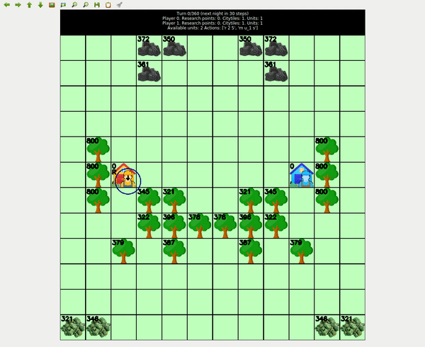

# Learning to imitate the best leaderboard agents using Conditional Unet
<!---https://www.kaggle.com/wiki/WinningModelDocumentationTemplate --->

The final solution for the Lux AI challenge used Imitation Learning with a [Conditioned Unet](https://github.com/gabolsgabs/cunet). The conditioning mechanism was used to provide global information about the state of the game and
also the identify of the agent the model need to imitate. Thus the model learned to imitate multiple different
agents at the same time. By learning to imitate different agents the model generalized better, probably
because it had to learn better representations of the data. One funny thing of this approach is that
the model can imitate the different agents on prediction also.

This approach worked because Toad Brigade agents were much better than the other teams. At the time of closing the submission period there is a difference of ~300 points in leaderboard between my agents and Toad Brigade's agents, it may go down because my best agents did not have time to converge but the difference is big. So the lesson learned is that using imitation learning
can provide a very strong agent, but 300 matches are not enough to get a good copy of the agent.

## Training data

All matches from agents with a leaderboard score higher than 1700 on 01/12/2021 were used for training. That comprises a total of 82 different agents and close to 16k matches.

For validation 10% of the matches from the best leaderboard agent were used.

```bash
python create_multiagent_imitation_learning_training.py /mnt/hdd0/Kaggle/luxai/models/51_models_for_submissions/template.yml /mnt/hdd0/Kaggle/luxai/models/51_models_for_submissions 0 /home/gbarbadillo/luxai_ssd/agent_selection_20211201.csv 1700
```

## Features

All features are defined on `luxai/input_features.py`

### Map features

This involve features that have are 2d.

```python
CHANNELS_MAP = dict(
    wood=0, coal=1, uranium=2,
    player_worker=3, player_cart=4, player_city=5,
    opponent_worker=6, opponent_cart=7, opponent_city=8,
    cooldown=9, road_level=10,
    player_city_fuel=11, opponent_city_fuel=12,
    player_unit_cargo=13, opponent_unit_cargo=14,
    player_unit_fuel=15, opponent_unit_fuel=16,
    player_city_can_survive_next_night=17, opponent_city_can_survive_next_night=18,
    player_city_can_survive_until_end=19, opponent_city_can_survive_until_end=20,
    resources_available=21, fuel_available=22,
    player_is_unit_full=23, is_cell_emtpy=24, player_can_build_city=25,
    player_obstacles=26, playable_area=27,
)
```

I believe the names are self-explicative so please go to the code if you need more details for
each feature. All the features are normalized.

### Global features

```python
FEATURES_MAP = dict(
    step=0, is_night=1, is_last_day=2,
    player_research_points=3, opponent_research_points=4,
    is_player_in_coal_era=5, is_player_in_uranium_era=6,
    is_opponent_in_coal_era=7, is_opponent_in_uranium_era=8,
    hour=9, city_diff=10,
    unit_free_slots=11,
)
```

In adittion to those features an extra feature is given representing the identity of the agent the
model needs to imitate. This is a simple one hot encoding. In the ohe the agents are sorted by leaderboard
score so first index is the best agent and last index is the worse. This can be used later on
prediction to choose which agent the model will imitate.

This features are feed to the conditioning branch.

## Model architecture

The model uses the [Conditioned Unet](https://github.com/gabolsgabs/cunet) with some variations to tune
the architecture for the challenge. It is implemented on `luxai/cunet.py`


The model has almost 24M of parameters. It has 4 levels and all of them have the same number of filters: 512

```python
(None, 32, 32, 28) # map features input size
(None, 32, 32, 512) # level 1
(None, 16, 16, 512) # level 2
(None, 8, 8, 512) # level 3
(None, 4, 4, 512) # level 4
```

The model has 4 outputs, 2 for units and 2 for cities. The first output is sigmoid and predicts wether
the city or the unit has to take an action. The second output is a softmax that predicts the distribution
over the possible actions. More details about the output can be found at `luxai/output_features.py`

```python
(None, 32, 32, 1) # unit_action output
(None, 32, 32, 10) # unit_policy output
(None, 32, 32, 1) # city_action output
(None, 32, 32, 3) # city_policy output

UNIT_ACTIONS_MAP = {
    'm n': 0, # move north
    'm e': 1, # move east
    'm s': 2, # move south
    'm w': 3, # move west
    't n': 4, # transfer north
    't e': 5, # transfer east
    't s': 6, # transfer south
    't w': 7, # transfer west
    'bcity': 8, # build city
    'p': 9, # pillage
}


CITY_ACTIONS_MAP = {
    'r': 0, # research
    'bw': 1, # build worker
    'bc': 2, # build cart
}
```

## Training

Training the model on a single 3090 gpu usually takes less than one day. All the outputs are trained
using masked losses. The action prediction output is only trained when the unit is active, and the policy output is only trained when the unit took an action.

The validation errors of the best model can be found below.

|              | unit             |                  | city             |                  |
|--------------|------------------|------------------|------------------|------------------|
| name         | action error (%) | policy error (%) | action error (%) | policy error (%) |
| best_model   | 10               | 18               | 0.21             | 6.3              |

The training parameters used on the final solution are:

```yaml
model_params:
  board_shape:
  - 32
  - 32
  - 28
  layer_filters:
  - 512
  - 512
  - 512
  - 512
  dropout:
  - 0
  - 1
  - 0
  - 0
  final_layer_filters: 512
  z_dim: 94
  control_type: dense
  film_type: complex
  n_neurons:
  - 16
  lr: 0.001
  loss_weights:
    unit_action: 1
    city_action: 0.1
    unit_policy: 1
    city_policy: 0.1
train_kwargs:
  epochs: 600
  steps_per_epoch: 4000
  validation_steps: 75
  verbose: 2
callbacks:
  EarlyStopping:
    monitor: val_loss
    patience: 40
  ModelCheckpoint_best_val_loss:
    filepath: '%s/best_val_loss_model.h5'
    monitor: val_loss
    save_best_only: true
  ReduceLROnPlateau:
    monitor: val_loss
    factor: 0.7
    patience: 5
    min_lr: 0.0001
data:
  max_queue_size: 200
  train:
    n_matches: 50
    batch_size: 128
    matches_json_dir: /home/gbarbadillo/luxai_ssd/matches_20211014/matches_json
    matches_cache_npz_dir: /home/gbarbadillo/luxai_ssd/matches_npz_v2
    agent_selection_path: /mnt/hdd0/Kaggle/luxai/models/51_models_for_submissions/seed0_threshold1700_512x4_oversample2/train.csv
    submission_id_to_idx_path: /mnt/hdd0/Kaggle/luxai/models/51_models_for_submissions/seed0_threshold1700_512x4_oversample2/submission_id_to_idx.yml
  val:
    n_matches: 50
    batch_size: 128
    matches_json_dir: /home/gbarbadillo/luxai_ssd/matches_20211014/matches_json
    matches_cache_npz_dir: /home/gbarbadillo/luxai_ssd/matches_npz_v2
    agent_selection_path: /mnt/hdd0/Kaggle/luxai/models/51_models_for_submissions/seed0_threshold1700_512x4_oversample2/val.csv
    submission_id_to_idx_path: /mnt/hdd0/Kaggle/luxai/models/51_models_for_submissions/seed0_threshold1700_512x4_oversample2/submission_id_to_idx.yml
```

```bash
python train_with_generators.py /mnt/hdd0/Kaggle/luxai/models/51_models_for_submissions/seed0_threshold1700_512x4_oversample2/train_conf.yml
```

## Agent

There is a script in `scripts/create_cunet_agent` that copies the necessary code from the library and creates an standalone agent.
It is possible to use data augmentation at prediction and horizontal flip is being used.

```bash
python create_cunet_agent.py ../../agents/nairu_th02 /mnt/hdd0/Kaggle/luxai/models/51_models_for_submissions/seed0_threshold1700_512x4_oversample2/best_val_loss_model.h5
```

## Agent evolution summary

| Name              | Score=(μ - 3σ) | Mu: μ, Sigma: σ   | Matches | Iteration                                                |
|-------------------|----------------|-------------------|---------|----------------------------------------------------------|
| nairu_th02        | 29.0           | μ=31.473, σ=0.809 | 749     | Iteration 19. Multi agent imitation learning             |
| batman_th02       | 28.8           | μ=31.312, σ=0.843 | 927     | Iteration 19. Multi agent imitation learning             |
| obelix_tw16       | 27.0           | μ=29.548, σ=0.835 | 880     | Iteration 17. Bigger models                              |
| terminator        | 26.1           | μ=28.574, σ=0.824 | 724     | Iteration 16. Find best curriculum learning strategy     |
| stacy             | 25.0           | μ=27.427, σ=0.818 | 745     | Iteration 16. Find best curriculum learning strategy     |
| fitipaldi         | 24.9           | μ=27.391, σ=0.828 | 670     | Iteration 15. Add new input features                     |
| megatron          | 22.6           | μ=25.150, σ=0.838 | 640     | Iteration 14. Curriculum for imitation learning          |
| optimus_prime     | 22.3           | μ=24.804, σ=0.821 | 582     | Iteration 11. Architecture search                        |
| three_toad_deluxe | 19.3           | μ=21.823, σ=0.852 | 589     | Iteration 10. Download more data for pretraining         |
| superfocus_64     | 18.6           | μ=21.228, σ=0.878 | 544     | Iteration 7. Focus on data from a single or a few agents |
| pagliacci_64      | 12.8           | μ=15.804, σ=0.987 | 528     | Iteration 5. Imitation learning with data augmentation   |
| napoleon_128      | 10.0           | μ=13.108, σ=1.046 | 448     | Iteration 6. Training on all the data                    |

According to this [python implementation of trueskill](https://trueskill.org/) if the different of score
is 4.17 then the probability of winning is 76%. The table above shows a steady progress in local validation
score during the challenge.

## Little story about my experience with the challenge

From the beginning I realized that the complexity of the game and the slow simulation will make reinforcement
learning very hard. Thus I first tried writing a rule based agent with was fun at first but after some weeks
working on it without improvements I decided to create a game interface to play the game myself
and gain a better understanding of the game.



After playing some games and watching replays from the leaderboard I had the feeling that I was able
to play much better than the best agents at that time. Thus I decided to use imitation learning to copy
my style of playing.

However I did a proof of concept using games from the leaderboard to see how many matches were needed
to train an agent. Since there was 2d map information and also global information I decided to use
a conditional unet for the experiment. It turned to work surprisingly well reaching top positions in
the leaderboard. At that time Toad Brigade had started to lead with big distance over the other teams,
so I decided to skip the part of playing the game myself and just copy Toad Brigade.

The rest of the challenge was spend doing multiple optimizations to the model, data...

Finally after many experiments with dropout, regularization and model capacity to try to improve
generalization of the model I had the idea of giving the identity of the agent to imitate as input
in the condition branch. This has given a boost on local validation scores, hopefully it will also work
on the leaderboard.